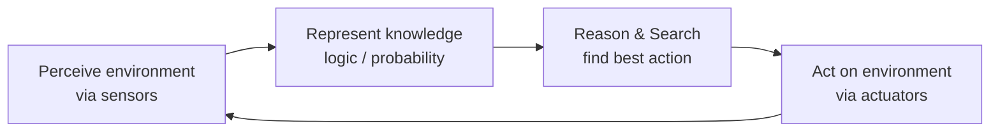
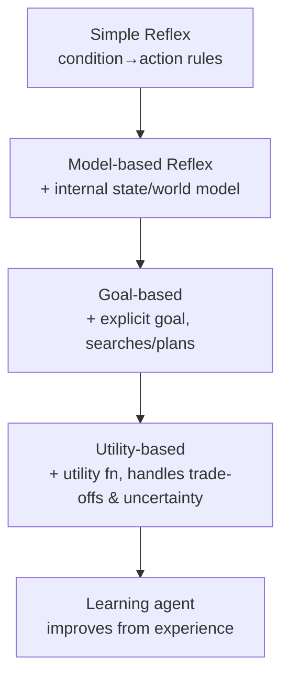
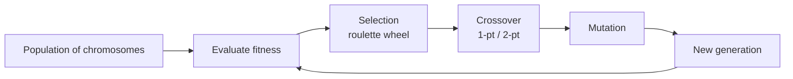
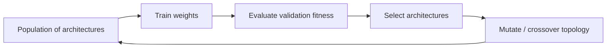
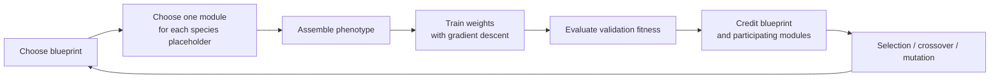

# Artificial and Computational Intelligence (AIMLCZG557) — Master Study Notes

> **Course:** AIMLCZG557 · BITS Pilani WILP · **Faculty:** Prof. Indumathi Prabakeran
> **Notes updated:** 2026-09-16 · **Textbook:** T1 — Russell & Norvig, *Artificial Intelligence: A Modern Approach*, 4th ed.
> **Status:** Living document. Append new class notes at the bottom under *"Update Log"* and add the topic to the map.

## How to use this note
1. **First pass (understand):** read each module's *Intuition* + *Key ideas*, ignore proofs.
2. **Second pass (retain):** redo every *Worked example* on paper without looking.
3. **Exam pass:** study the 🎯 **Exam pointers**, the **Cheat Sheet**, and answer the **Self-test** questions.
4. Icons: 💡 intuition · 🧮 formula · 🎯 likely in exam · ⚠️ common mistake · 🔁 revision hook.

---

## 0. The Big Picture — What is this course really about?

Computers are fast but not *smart*. This course studies how to make a program **act rationally** — choose, for every situation, the action expected to best achieve its goal given what it knows. Everything else (search, logic, probability, optimization) is just *machinery* for computing that best action.



**Two halves of the title:**
- **Artificial Intelligence** — agents, search, logic, probabilistic reasoning (Russell & Norvig).
- **Computational Intelligence** — nature-inspired optimization: Genetic Algorithms, Particle Swarm, Ant Colony (used when the search space is huge and we only need a *good* answer fast).

### Syllabus / Topic map (taught so far → extends with future classes)
| # | Module | Core question |
|---|--------|---------------|
| M1 | Intro to AI | What is intelligence? What is rationality? |
| M2 | Intelligent Agents & PEAS | How do we *specify* an intelligent system? |
| M3 | Uninformed & Online Search (CS#4/CS#6) | How to search with no hints or no advance world model? |
| M4 | Informed Search & Heuristic Design (CS#5 expanded) | How do we invent, compare, and learn useful hints? |
| M5 | Local Search, GA & ACO (CS#6 expanded) | How to optimize when paths don't matter? |
| M6 | Adversarial Search, Alpha-Beta & MCTS (CS#8 expanded) | How to act when an opponent fights back? |
| M7 | Constraint Satisfaction (CSP) | How to solve "assign values under constraints"? |
| M8 | Logic & Knowledge Representation | How to store facts and *infer* new ones? |
| M9 | Probabilistic Reasoning | How to reason under uncertainty (Bayes, HMM)? |
| M10 | Computational Intelligence & NAS (CS#7 expanded) | Can evolution design the neural network itself? |

### 📋 Evaluation structure
- **EC1 – Continuous (30):** Assignment-1 (12, before mid-sem) + Assignment-2 (13, after) + Quizzes best-of-2 (5).
- **EC2 – Mid-sem (30):** topics **CS#1–CS#8** (agents → search → local/evolutionary search → game playing). **2 hours, 30 marks, subjective, online at the exam centre.**
- **EC3 – Comprehensive (40):** **CS#1–CS#16** (adds logic, Bayes nets, HMM/Viterbi, games).

> 🎯 **From the actual papers:** EC2 tested **GA (roulette/crossover/mutation), PSO, ACO**. EC3 tested **Minimax, FOL quantifiers, Bayesian networks, HMM + Viterbi, Tree-vs-Graph search, Hill-climbing/SA/Beam**. Expect *numerical, work-it-out* questions, not just definitions.

> 🎯 **Faculty clarification (CS#5):** expect problem/scenario-based and descriptive questions; no programming question or requirement to reproduce code. Practise choosing and applying the method, not memorizing pseudocode alone.

---

## M1 · Introduction to AI

### 1.1 Four ways to define AI
Two axes: **thought vs behaviour** and **human-like vs rational**.

|  | **Human-like** | **Rational (ideal)** |
|--|----------------|----------------------|
| **Thought** | (1) Thinking Humanly — *cognitive modelling* | (3) Thinking Rationally — *laws of thought (logic)* |
| **Behaviour** | (2) Acting Humanly — *Turing Test* | (4) Acting Rationally — **Rational Agent** ✅ this course |

- **(1) Thinking humanly** — model actual human cognition (introspection, psychology, brain imaging). *"General Problem Solver"* (Newell & Simon) compared its reasoning trace to humans; first system to separate **Knowledge Base + Inference**.
- **(2) Acting humanly — Turing Test:** a machine is intelligent if an interrogator cannot distinguish it from a human. Needs **NLP, Knowledge Representation, Automated Reasoning, ML** (+ Vision & Robotics for the *Total* Turing Test). ⚠️ Problems: not reproducible / not mathematically analyzable.
- **(3) Thinking rationally — laws of thought:** Aristotle's **syllogisms**. 💡 *All humans are mortal; Socrates is a human; ∴ Socrates is mortal.* Problems: not all intelligent behaviour is logical (reflexes); logic is computationally explosive → not scalable.
- **(4) Acting rationally — Rational Agent:** *do the right thing* = the action expected to **maximize goal achievement** given available information. Includes correct inference, inference under uncertainty, **and** acting without inferring (reflex, e.g. recoiling from a hot stove).

> 💡 **Norvig's analogy:** aeronautics doesn't aim to build "machines that fly *so exactly like pigeons* they fool other pigeons." We want *flight* (rationality), not imitation.

### 1.2 Foundations (where AI borrows from)
Philosophy (logic, mind, reasoning) · Mathematics (logic, computation, probability, algorithms) · Economics (decision theory, game theory, MDPs) · Neuroscience (brains) · Psychology (cognition) · Computer Engineering (fast machines) · Control theory/Cybernetics · Linguistics.

### 1.3 Risks & ethics of AI 🎯
Lethal autonomous weapons (scalability with no human supervision) · mass surveillance & persuasion · **biased decision-making** (biased data → biased parole/loan decisions) · impact on employment (shifts wealth **labour → capital**) · safety-critical failures · cybersecurity (AI-powered phishing/blackmail) · deepfakes · sustainability.

---

## M2 · Intelligent Agents

### 2.1 Agent = Architecture + Program
> 🧮 An **agent** perceives its **environment** through **sensors** and acts through **actuators**. The **agent function** maps *percept histories → actions*: $f : P^{\ast} \rightarrow A$. The **agent program** implements $f$ on the physical **architecture**.

- **Percept** = one input observation; **percept sequence** $P^{\ast}$ = full history.
- **Rational agent:** *"For each possible percept sequence, choose the action that maximizes the expected performance measure, given evidence so far + built-in knowledge."*
- **Rationality ≠ omniscience** (can't know the future). Rational agents also do **information gathering / exploration** and are **autonomous** (learn from experience).
- **Bounded rationality:** choose the optimal action given *limited computation* (perfect rationality is usually unachievable).

### 2.2 PEAS — how to specify a task environment 🎯
**P**erformance measure · **E**nvironment · **A**ctuators · **S**ensors.

| System | Performance | Environment | Actuators | Sensors |
|--------|-------------|-------------|-----------|---------|
| **Automated taxi** | safe, fast, legal, comfortable, profit | roads, traffic, signals, pedestrians | steering, accelerator, brake, horn, signal | cameras, GPS, speedometer, sonar, odometer |
| **Medical diagnosis** | healthy patient, min cost & lawsuits | patient, hospital, staff | screen (questions, tests, diagnoses) | keyboard (symptoms, answers) |
| **Part-picking robot** | % parts in correct bins | conveyor belt, parts, bins | jointed arm & hand | camera, joint-angle sensors |

> ⚠️ **Exam habit:** when asked to "design an agent", *always start with PEAS*, then classify the environment (below), then pick an agent type.

### 2.3 Environment properties 🎯
| Property | Meaning | Example |
|----------|---------|---------|
| **Fully vs Partially observable** | do sensors give the complete state? | Chess (full) vs Poker (partial) |
| **Deterministic vs Stochastic** | next state fixed by (state, action)? | 8-puzzle (det.) vs self-driving in rain (stoch.) |
| **Episodic vs Sequential** | do current choices affect the future? | "cat in image?" (episodic) vs Pac-Man (sequential) |
| **Static vs Dynamic** | can the world change while you think? | crossword (static) vs driving (dynamic); *semi-dynamic* = chess-with-clock |
| **Discrete vs Continuous** | finite distinct states/actions? | chess (discrete) vs taxi (continuous) |
| **Single vs Multi-agent** | others present? cooperative/competitive | maze (single) vs chess (competitive) |

> 💡 **The real world is** partially observable, stochastic, sequential, dynamic, continuous, multi-agent — the *hardest* box.

### 2.4 The five agent types (increasing sophistication)

1. **Simple reflex** — `if dirty then Suck`. Fails if environment is partially observable.
2. **Model-based reflex** — keeps **internal state** using a **transition model** (how the world evolves) + **sensor model** (how percepts reflect the world).
3. **Goal-based** — has an explicit **goal**; uses **search/planning** to reach it.
4. **Utility-based** — has a **utility function** to compare states → handles conflicting goals & uncertainty (maximizes *expected* utility).
5. **Learning agent** — four parts:
   - **Performance element** — picks actions (the "agent so far").
   - **Learning element** — improves the performance element.
   - **Critic** — gives feedback vs a performance standard.
   - **Problem generator** — suggests exploratory (sub-optimal) actions so the agent learns new things. 💡 *exploration vs exploitation lives here.*

> ⚠️ **Table-driven agent** (lookup table of percept-seq → action) is rejected: table is astronomically huge, slow to build, no autonomy.

---

## M3 · Problem Solving as Search

### 3.1 Problem formulation — the 5 components 🎯
A **problem-solving (goal-based) agent** does **Formulate → Search → Execute**. A problem is defined by:

| Component | Meaning | Romania example |
|-----------|---------|-----------------|
| **Initial state** | where the agent starts | `In(Arad)` |
| **Actions** | applicable actions in a state | `{Go(Sibiu), Go(Timisoara), Go(Zerind)}` |
| **Transition model** `RESULT(s,a)` | resulting state | `RESULT(In(Arad),Go(Sibiu))=In(Sibiu)` |
| **Goal test** | is this a goal? | `IsGoal(In(Bucharest))` |
| **Path cost** $g(n)$ | numeric cost of a path | `cost(Arad→Sibiu)=140 km` |

- Fix the **objective** before searching: minimize distance/time/cost, or maximize profit/utility. For a maximization problem, either use an algorithm designed for larger-is-better scores or convert it to a cost consistently.
- **State** = all info needed to decide. **State space** = all states reachable from the initial state (a graph: nodes=states, arcs=actions).
- **Abstraction:** drop irrelevant detail (radio, scenery) — keep only what affects the solution.
- **Node vs State:** a *node* is a bookkeeping record (`STATE, PARENT, ACTION, PATH-COST g(n)`); two different nodes can hold the same state (reached by different paths).
- **Frontier** = set of nodes waiting to be expanded, stored in a queue: **FIFO→BFS**, **LIFO→DFS**, **Priority→UCS/A***.

**Toy problems (memorize the formulations):**
- **Vacuum world:** 2 locations × dirt/clean = $2\times2^2 = 8$ states; actions `Left, Right, Suck`.
- **8-puzzle:** $9!/2 = 181440$ reachable states; actions = move the *blank* Up/Down/Left/Right; each step cost 1.

### 3.2 Measuring a search strategy 🎯
- **Complete?** always finds a solution if one exists.
- **Optimal?** always finds the *least-cost* solution.
- **Time complexity** — # nodes generated. **Space complexity** — max nodes in memory.
- Parameters: $b$ = branching factor, $d$ = depth of shallowest goal, $m$ = max depth of the space.

### 3.3 Uninformed search (no domain knowledge)
| Algorithm | Frontier | Complete | Optimal | Time | Space |
|-----------|----------|:---:|:---:|:---:|:---:|
| **BFS** | FIFO queue | Yes (finite $b$) | Yes *(if unit cost)* | $O(b^d)$ | $O(b^d)$ ⚠️ huge |
| **Uniform-Cost (UCS)** | priority by $g(n)$ | Yes | **Yes** (any ≥0 cost) | $O(b^{1+\lfloor C^{\ast}/\varepsilon\rfloor})$ | same |
| **DFS** | LIFO stack | No (infinite/loops) | No | $O(b^m)$ | $O(bm)$ ✅ small |
| **Depth-Limited (DLS)** | DFS to depth $\ell$ | No (if $\ell<d$) | No | $O(b^\ell)$ | $O(b\ell)$ |
| **Iterative Deepening (IDS)** | DLS with $\ell=0,1,2,\dots$ | **Yes** | Yes *(unit cost)* | $O(b^d)$ | $O(bd)$ ✅ |
| **Bidirectional** | search from both ends | Yes | Yes* | $O(b^{d/2})$ | $O(b^{d/2})$ |

- **BFS:** expand all nodes at depth $k$ before depth $k{+}1$. Good for "fewest steps".
- **UCS (Dijkstra):** expand lowest $g(n)$ first; **goal test on *expansion*, not generation** (so a cheaper path can still replace a node on the frontier). 💡 This is why UCS is optimal even with varying costs.
- **DFS:** memory-cheap but can loop / miss shallow goals.
- **IDS:** ⭐ best uninformed method — DFS's linear memory **+** BFS's completeness/optimality; re-expanding shallow nodes is cheap because the last level dominates the count.
- **Applications:** BFS → shortest path, graph bipartition; DFS → connectivity, topological sort.

> 🧮 **UCS worked example (Sibiu→Bucharest):** expand cheapest $g$ each step — Sibiu→{Rimnicu 80, Fagaras 99} → expand Rimnicu → Pitesti 177 → expand Fagaras → Bucharest **310** (don't stop! not tested on generation) → expand Pitesti → Bucharest **278** (replace, cheaper) → expand Bucharest (278) = **goal, optimal**.

### 3.3.1 Open/closed lists and one graph three ways (CS#4)
- **Open list / frontier** = generated nodes waiting to be expanded. Its ordering defines the algorithm: FIFO for BFS, LIFO for DFS, lowest $g$ for UCS.
- **Closed list / explored set** = states already expanded. When a node leaves open for expansion, record its state in closed; reject repeated states unless the algorithm permits reopening after finding a cheaper path.

Use this weighted graph (neighbour order left-to-right): $1\!\to\!2:70$, $1\!\to\!3:125$, $1\!\to\!4:100$, $2\!\to\!3:50$, $2\!\to\!5:125$, $3\!\to\!4:100$, $3\!\to\!5:100$, $4\!\to\!5:50$.

| Strategy | Expansion logic | Returned path | Cost | Lesson |
|----------|-----------------|---------------|-----:|--------|
| **BFS** | levels/FIFO: after expanding 1, open starts `[2,3,4]` | $1\to2\to5$ | 195 | fewest edges, **not** cheapest weighted path |
| **DFS** | deepest/LIFO (left-first here) | $1\to2\to3\to4\to5$ | 270 | result depends on successor order; not optimal |
| **UCS** | lowest path cost: $2(70),4(100),3(120),5(150)$ | $1\to4\to5$ | **150** | cheapest non-negative-cost path |

> 🎯 **Exam trap:** BFS is optimal only when step costs are equal. On weighted graphs, use UCS. Also remember that UCS may replace an existing frontier entry with a cheaper route and tests the goal only when that node is removed for expansion.

### 3.4 🔁 Tree Search vs Graph Search (EC3 favourite)
- **Tree search** = no memory of visited states → may re-expand the same state many times (exponential blow-up with cycles).
- **Graph search** = keeps an **explored/closed set** → each state expanded once.
- **Graph search wins big** when the space has **many repeated states / cycles** (grids, maps). Cost: extra memory for the closed set. ⚠️ For graph-search **A*** to stay optimal, the heuristic must be **consistent** (not just admissible).

For a cycle $A\to B\to A$, tree search can generate $A,B,A,B,\ldots$ forever. Graph search closes $A$ after expansion, so the $A$ generated from $B$ is recognized as a repeat.

### 3.5 Offline vs online search agents (CS#6) 🎯
| | **Offline search** | **Online search** |
|---|---|---|
| Knowledge before acting | Complete model or generatable state space | Environment/actions may initially be unknown |
| Timing | Plan first, then execute | Interleave **act → observe → update → plan** |
| Main challenge | Search cost | Exploration, irreversible actions, and real action cost |
| Examples | BFS, UCS, A*, hill climbing, local beam | Robot exploring an unfamiliar building |

An online agent maintains the part of the map it has discovered, tries an action, observes the actual successor and cost, and updates its model. It is appropriate when the world is unknown, dynamic, or too large to model beforehand. ⚠️ "Online" here means **planning while acting**, not merely "connected to the Internet."

---

## M4 · Informed (Heuristic) Search

A **heuristic** $h(n)$ = cheap estimate of the cost from $n$ to the goal (extra knowledge beyond the problem definition).

### 4.1 Greedy Best-First vs A*
- **Greedy best-first:** expand node minimizing $h(n)$. Fast but **not optimal, not complete** (can chase a misleading estimate).
- **A\* search:** expand node minimizing
```math
f(n) = g(n) + h(n) \quad=\quad \text{cost so far} + \text{estimated cost to goal.}
```

### 4.2 When is A* optimal? (know these cold) 🎯
- **Admissible** heuristic: **never overestimates** the true cost, $0 \le h(n) \le h^{\ast}(n)$. → A* with **tree search** is optimal.
- **Consistent (monotone):** $h(n) \le c(n,a,n') + h(n')$ for every edge (triangle inequality). → A* with **graph search** is optimal, and $f$ never decreases along a path.
- **Consistent ⟹ admissible** (not vice-versa).
- **Dominance:** if $h_2(n) \ge h_1(n)$ for all $n$ (both admissible), $h_2$ is better — it expands fewer nodes. Combine with $h(n)=\max(h_1,h_2)$.

**Classic admissible heuristics (8-puzzle):** $h_1$ = # misplaced tiles; $h_2$ = **Manhattan distance** (sum of tile moves). $h_2$ dominates $h_1$.

> ⚠️ **Common mistakes:** (1) forgetting to add $g(n)$ (that's greedy, not A*); (2) claiming A* is optimal with an *inadmissible* heuristic; (3) using graph-search A* with a merely-admissible (non-consistent) $h$.

- **AO\*** — for **AND-OR graphs** (problems that decompose into sub-problems that must *all* be solved). **A\*** works on OR-graphs (alternative paths).

### 4.3 Designing heuristics (CS#5) 🎯
A heuristic is not magic: derive a cheap estimate from a simpler version of the real problem, then test how much search it saves.

#### Four design routes
1. **Relax the problem:** remove one or more constraints. Solving the easier problem gives a lower bound, so its optimal cost is admissible for the original problem.
2. **Pattern database:** precompute exact costs for selected subproblems and look them up during search. Disjoint pattern costs may sometimes be added; otherwise `max` is the safe admissible combination.
3. **Learn from experience:** fit a model to predict remaining cost from previously solved states, then verify admissibility/consistency if optimality is required.
4. **Compare by effective branching factor:** $b^{\ast}$ turns the observed search effort into an easy-to-compare number: the average number of successors per node that a perfectly uniform tree would need to contain the same number of generated nodes.

**Symbols:**
- $N$ = number of generated nodes, excluding the root
- $d$ = depth of the solution found
- $b^{\ast}$ = effective branching factor to be estimated

Why are there powers of $b^{\ast}$? Each level multiplies the preceding level's node count by $b^{\ast}$:

| Level | Nodes at that level | Reason |
|---:|---:|---|
| 0 | $1=(b^{\ast})^0$ | the root |
| 1 | $b^{\ast}$ | the root has about $b^{\ast}$ successors |
| 2 | $(b^{\ast})^2$ | $b^{\ast}$ nodes each have about $b^{\ast}$ successors |
| 3 | $(b^{\ast})^3$ | multiply by $b^{\ast}$ once more |

Therefore, the total number of generated nodes, including the root, is

```math
N+1=1+b^{\ast}+(b^{\ast})^2+\cdots+(b^{\ast})^d.
```

The powers are not repeated answers. They represent the number of nodes at successive depths: power 0 for the root, power 1 for level 1, power 2 for level 2, up to power $d$ for the final level.

Usually $b^{\ast}$ is found numerically. For example, if $N=14$ and $d=3$, substitute these values:

```math
14+1=1+b^{\ast}+(b^{\ast})^2+(b^{\ast})^3.
```

Trying $b^{\ast}=2$ gives

```math
15=1+2+2^2+2^3=1+2+4+8=15.
```

So $b^{\ast}=2$. For the same problem and solution depth, a smaller $b^{\ast}$ means fewer nodes were needed, so the heuristic guided the search more effectively. It does not mean that every real node literally had $b^{\ast}$ children.

#### Relaxed-problem examples
- **8-puzzle:** if a tile may teleport to its goal, the relaxed cost is **misplaced tiles**. If tiles may pass through one another but still move horizontally/vertically, the relaxed cost is **Manhattan distance**. Both are lower bounds on legal blank-swaps.
- **N-queens:** the real solution has no shared row, column, or diagonal. Relaxing one constraint produces an easier scoring problem. Useful local-search scores include **conflicting pairs** (minimize) or **non-conflicting pairs** (maximize); keep the score direction explicit.

#### Worked 8-puzzle comparison
For the initial and goal boards below (exclude the blank from both heuristics):

| Initial | Goal |
|---------|------|
| `7 2 4`<br>`5 6 8`<br>`3 1 _` | `_ 1 2`<br>`3 4 5`<br>`6 7 8` |

- **Misplaced-tile heuristic:** $h_1=8$ because all eight numbered tiles are outside their goal cells.
- **Manhattan-distance heuristic:** for each numbered tile $i$, count its horizontal moves plus its vertical moves to the goal, ignoring other tiles:

```math
h_2=\sum_{i=1}^{8}\left(\lvert x_i-x_i^{goal}\rvert+\lvert y_i-y_i^{goal}\rvert\right).
```

Here $(x_i,y_i)$ is tile $i$'s current row and column, while $(x_i^{goal},y_i^{goal})$ is its goal row and column. The blank is not included.

    | Tile | Current → goal | Horizontal + vertical distance |
    |---:|---|---:|
    | 7 | $(1,1)\to(3,2)$ | $2+1=3$ |
    | 2 | $(1,2)\to(1,3)$ | $0+1=1$ |
    | 4 | $(1,3)\to(2,2)$ | $1+1=2$ |
    | 5 | $(2,1)\to(2,3)$ | $0+2=2$ |
    | 6 | $(2,2)\to(3,1)$ | $1+1=2$ |
    | 8 | $(2,3)\to(3,3)$ | $1+0=1$ |
    | 3 | $(3,1)\to(2,1)$ | $1+0=1$ |
    | 1 | $(3,2)\to(1,2)$ | $2+0=2$ |

Therefore,

```math
h_2=3+1+2+2+2+1+1+2=14.
```

In plain English: if every tile could move independently, at least 14 one-cell moves would be required. The legal puzzle may require more moves because tiles block one another and the blank must be repositioned.
- Manhattan distance dominates here and generally carries more information than a binary misplaced/not-misplaced count. With only four-direction legal moves, neither estimate exceeds the true remaining number of blank-swaps.

> ⚠️ **Heuristic-combination rule:** if $h_1$ and $h_2$ are admissible, $h(n)=\max(h_1(n),h_2(n))$ remains admissible and is at least as informed as either component. Do not add overlapping estimates unless their costs are provably disjoint.

#### Worked N-queens heuristic design (CS#5 live discussion)
Suppose a partial board has three queens and the successor generator temporarily relaxes the **column** constraint while retaining the row/diagonal structure. Generating a state under a relaxed rule does not mean its heuristic should ignore the real goal: the score must still indicate how close the board is to **all queens being mutually safe**.

For $q$ queens there are $\binom q2$ pairs. Two equivalent score directions are:
```math
h_{\text{safe}}(s)=\#\text{ non-conflicting queen pairs}\quad\text{(maximize)},
```
```math
h_{\text{conflict}}(s)=\#\text{ conflicting queen pairs}\quad\text{(minimize)},
```
with $h_{\text{safe}}(s)+h_{\text{conflict}}(s)=\binom q2$.

✍️ With three queens, there are $\binom32=3$ pairs. A successor with all three pairs safe scores $(h_{\text{safe}},h_{\text{conflict}})=(3,0)$ and is preferred to one scoring $(2,1)$. Multiple successors may tie; the heuristic guides search toward promising states but need not uniquely select one.

⚠️ Write the optimization direction beside the score. "Number of safe pairs" is larger-is-better; "number of conflicts" is smaller-is-better. Mixing those directions is a common source of wrong expansions.

#### Learned heuristics: the CNN case study
Hand-designed Manhattan distance is not the only option. The paper discussed in class learns a scalar estimate from grid states:
```math
h_\theta(s)=\text{CNN}_\theta(s),
```
where $s$ is a 2-D grid and $\theta$ contains learned network parameters. The presented model used convolutional processing, convolution-plus-attention blocks, **mean pooling**, and a fully connected output that predicts one heuristic value. Example domains included a box-pushing warehouse puzzle, a maze with teleports, and sliding tiles.

The search algorithm then consumes the prediction in the usual way:
- **A\*:** expand the smallest $f(n)=g(n)+h_\theta(n)$.
- **Greedy best-first:** expand the smallest $h_\theta(n)$ and ignore path cost.

💡 Learning is useful when manually encoding a good estimate is difficult and solved historical states are available. It also creates a new verification burden: prediction accuracy alone does not prove admissibility.

> ⚠️ **Optimality caveat:** an unconstrained neural prediction can overestimate or violate consistency. In that case, graph-search A* may be fast but loses its usual optimality guarantee. To claim optimality, verify or enforce $h_\theta(n)\le h^{\ast}(n)$ and the consistency inequality; otherwise report the method as approximate.

**Assigned-paper insight — rank, not exact cost:** Chrestien et al., *Optimize Planning Heuristics to Rank, not to Estimate Cost-to-Goal* (2023), argues that fitting the exact optimal cost-to-go $h^{\ast}$ can solve a harder learning problem than search actually needs. A forward search mainly needs the heuristic to **order the frontier usefully for that search algorithm**. Ranking losses therefore train pairs of states so the preferred state is expanded first. This can improve search efficiency even when numeric cost prediction is imperfect; it does **not** by itself establish admissibility or optimality.

| Choice | Evaluation | Typical trade-off |
|--------|------------|-------------------|
| **Greedy best-first** | $f(n)=h(n)$ | often fast, but can be incomplete/non-optimal |
| **A\*** | $f(n)=g(n)+h(n)$ | optimal under the stated heuristic conditions, usually more memory |

### 4.4 Worked A* with open/closed lists (webinar) 🎯
The informed-search webinar drilled the **open-list/closed-list bookkeeping** you must *show* for full marks. Procedure: keep an **open list** (frontier, nodes generated but not expanded) and a **closed list** (expanded). Each step: pick the open node with the **smallest $f=g+h$**, move it to closed, generate its neighbours (updating a neighbour's $g$ if a cheaper path is found), and **goal-test on expansion**.

✍️ **Trace** (start `S`, goal `G`; edge costs on arrows; $h(S)=5,h(A)=3,h(B)=4,h(C)=2,h(G)=0$):
`S→A=1, S→B=4, A→C=2, A→G=7, C→G=3`.

| Step | Expand | Open list (node: $g+h=f$) | Closed |
|------|--------|---------------------------|--------|
| 1 | `S` ($f{=}5$) | `A: 1+3=4`, `B: 4+4=8` | S |
| 2 | `A` ($f{=}4$) | `C: 3+2=5`, `B: 8`, `G: 8+0=8` | S,A |
| 3 | `C` ($f{=}5$) | `G: 6+0=6` (cheaper path, replaces 8), `B: 8` | S,A,C |
| 4 | `G` ($f{=}6$) | **goal reached** | — |

Result path **S→A→C→G, cost 6** (beats S→A→G = 8). 💡 Note step 3 **replacing** G's frontier entry with the cheaper route — the same reason UCS/A\* test the goal on *expansion*, not generation.

> 🎯 **Webinar exam tips:** (1) a node whose **heuristic is 0 is the goal**; (2) if the paper **doesn't give $h$**, it will tell you how to compute it (e.g. **Manhattan** or **Euclidean** distance to the goal) — $h(n)$ always measures *node → goal*, while $g$ measures *node → node* along the path; (3) always tabulate open/closed and the $f$ of every node so partial credit is easy to award.

---

## M5 · Local Search & Optimization 🎯

Used when **the path doesn't matter, only the final state** (e.g. n-queens, scheduling, TSP). Keep **one (or few) current state(s)** and move to neighbours — tiny, constant memory. We optimize an **objective / fitness** function over a landscape with peaks (maxima), valleys, ridges, plateaus.

| Algorithm | Idea | Escapes local optima? | Exploration vs Exploitation |
|-----------|------|:---:|---|
| **Hill Climbing** | always move to the best better neighbour | ❌ stuck at local max / plateau / ridge | pure **exploitation** |
| **Simulated Annealing (SA)** | sometimes accept a move that is worse by loss $\Delta>0$ with probability $e^{-\Delta/T}$; cool $T\to0$ | ✅ yes (early on) | exploration→exploitation as $T$ falls |
| **Local Beam Search** | keep best $k$ states, expand all, keep best $k$ of successors | partly (shares info across $k$) | $k$ parallel searches |
| **Genetic Algorithm** | population + selection + crossover + mutation | ✅ via mutation/recombination | population-level both |

- **Hill-climbing variants:** steepest-ascent, stochastic, first-choice, **random-restart** ("if at first you don't succeed, try, try again" — surprisingly effective).
- **Simulated Annealing:** first define the optimization direction. For a **cost-minimization** problem, a move is worse when

```math
\Delta=C_{new}-C_{current}>0.
```

Accept that worse move with probability

```math
P(\text{accept worse move})=e^{-\Delta/T},
```

where $T>0$ is the current temperature. Example: if cost rises from 20 to 23, then $\Delta=3$; at $T=10$, $P=e^{-3/10}\approx0.741$. High $T$ accepts many worse moves (exploration); low $T$ becomes nearly greedy (exploitation). For maximization, define $\Delta=F_{current}-F_{new}>0$ as the amount of lost fitness, then use the same formula. A sufficiently slow cooling schedule has a theoretical global-optimum guarantee under restrictive assumptions.

### 5.1 N-queens landscape and neighbourhoods (CS#6) 🎯
Represent an $n$-queens board by $[r_1,r_2,\ldots,r_n]$, where $r_i$ is the row occupied in column $i$. Keeping exactly one queen per column removes column conflicts by construction. Score a board by either:
```math
h_{\text{conflict}}=\#\text{ attacking pairs}\quad(\text{minimize}),\qquad
f_{\text{safe}}=\binom n2-h_{\text{conflict}}\quad(\text{maximize}).
```
For 4 queens the target is $h_{\text{conflict}}=0$ or $f_{\text{safe}}=\binom42=6$.

If a **$k$-neighbour move** changes exactly $k$ selected columns and each selected queen may move to any of the other $n-1$ rows, the number of generated neighbours is
```math
N_k=\binom nk(n-1)^k.
```
✍️ For 4 queens: $N_1=\binom41 3=12$ and $N_2=\binom42 3^2=54$. This matches the class expansion. State your move definition before counting; allowing "up to $k$" moves gives $\sum_{i=1}^{k}N_i$, a different answer.

**Hill-climbing failure modes:** a local maximum is better than every neighbour but not globally best; a plateau has many equal-valued states; a ridge requires a sequence of sideways/non-greedy moves. Remedies include limited sideways moves, stochastic/first-choice selection, and random restarts.

#### Webinar practical — implement the search, not random guessing (8 Sep) 🎯
For a **minimization** problem, the basic loop is:

```text
current = random_initial_state()
best = current
repeat until no better neighbour or iteration limit:
    candidate = perturb(current)          # a nearby state, not a fresh global sample
    if cost(candidate) < cost(current):
        current = candidate
    if cost(current) < cost(best):
        best = current
return best
```

The webinar's first car example used the toy objective $|time+speed+fuel-distance|$. It is useful for tracing updates, but its units cannot meaningfully be added. The important implementation correction was that generating a completely new random vector on every iteration is **random search**, not a walk through neighbouring states. A real hill climber perturbs the current vector by a bounded step and keeps the candidate only when it improves the objective.

The enhanced version used two separate records:
- `current` may move, including an occasional worse move with fixed probability $p=0.05$ to escape a local optimum.
- `best` stores the lowest-cost state ever seen, so exploration cannot erase the answer already found.

This fixed-probability escape is a simple **stochastic hill-climbing** heuristic. Do not confuse it with simulated annealing: SA makes the worse-move probability depend on both the amount by which the move is worse, $\Delta>0$, and a cooling temperature: $P=e^{-\Delta/T}$.

✍️ **Realistic route objective.** Define the quantities before combining them:
- $D=300$ km = required distance
- $v$ in km/h = chosen average speed, with $0<v\le v_{max}=80$ km/h
- $t$ in hours = travel time
- $m=15$ km/L = mileage, and $f$ in litres = fuel used

For a feasible constant-speed trip, the physical constraints are
```math
t=\frac{D}{v},\qquad f=\frac{D}{m}.
```
With time valued at ₹250/h and fuel at ₹100/L, the direct monetary cost is
```math
J_{base}=250t+100f.
```
If an optimizer is allowed to propose independent values of $t$, $v$, and $f$, enforce the distance relation $D=vt$ with a penalty:
```math
J(t,v,f)=250t+100f+
\underbrace{w_d\lvert D-vt\rvert}_{\text{distance-violation penalty}}
+\text{other constraint penalties},
```
where $w_d=₹1000/\text{km}$, so every term in $J$ has units of rupees. The penalty is zero for a feasible trip.

Assuming constant mileage and no violated constraints, the cheapest possible time occurs at the speed limit:
```math
t_{min}=\frac{300}{80}=3.75\text{ h},\qquad
f=\frac{300}{15}=20\text{ L},
```
```math
J_{base}=₹250(3.75)+₹100(20)=₹937.50+₹2000=\boxed{₹2937.50}.
```
Unlike the dimensionally invalid toy score, a feasible real objective need not reach zero: time and fuel genuinely cost money. The stopping condition should therefore be an iteration budget, no improving neighbour, or a tolerance/target appropriate to the domain — not blindly `cost == 0`.

> 🎯 **Exam takeaways:** hill climbing is informed/heuristic and greedy; it remembers the current state rather than the full path; for minimization, improvement means a lower objective; a local optimum is not necessarily global; and step size controls behaviour (tiny steps refine slowly, huge steps approach random search).

### 5.2 Local beam search — one shared beam, not $k$ restarts
Keep $k$ current states, generate **all** their successors, then retain the best $k$ successors overall. The searches share information because any current state can contribute zero, one, or many survivors. By contrast, random-restart hill climbing runs independent searches.

✍️ **CS#6 drill:** current states have values $12,15,10$; their pooled successors have values $16,11,14,18,13,17$. For maximization, the next beam is $\{18,17,16\}$. In **stochastic beam search**, successors are sampled with probabilities increasing with fitness rather than always taking the top $k$, preserving diversity.

### 5.3 Genetic Algorithms (GA) — EC2/CS#6 numerical 🎯

- **Chromosome** = encoded candidate solution (bit/real/permutation string); **gene** = one position; **fitness** = objective value.
- **Roulette-wheel selection (positive fitness, maximization):** if every $f_i\ge0$ and larger fitness is better,

```math
p_i=\frac{f_i}{\sum_j f_j}.
```

The denominator normalizes all slices so that $\sum_i p_i=1$. For a **cost-minimization** problem, do not insert raw costs into this formula: first convert cost to a positive fitness where lower cost produces larger fitness, for example $f_i=1/(C_i+\varepsilon)$ with $\varepsilon>0$.
- **Crossover** (recombine two parents at 1 or 2 cut points) = *exploitation of good building blocks*. **Mutation** (flip/increment a gene with small prob.) = *exploration / diversity*.
- **Stopping:** target fitness reached, maximum generations reached, or no useful change. ⚠️ A basic GA has no general convergence guarantee.
- **Selection methods:** roulette wheel, tournament, and rank selection. Roulette is random: high fitness means a higher chance, not guaranteed selection.
- **Worked-exam shape:** encode population → compute fitness → probabilities/cumulative wheel → select parent pairs → crossover → mutate → recompute offspring fitness.

✍️ **Roulette drill:** for fitnesses $[4,4,2,3]$, total fitness is $13$ and
```math
p=[4/13,4/13,2/13,3/13]\approx[0.308,0.308,0.154,0.231].
```
The two fitness-4 individuals tie for the highest probability. A fitness-2 individual can still be selected.

✍️ **Single-point crossover drill:** cut after position 4:
- $P_1=[1,2,3,4\mid5,6,7,8]$, $P_2=[8,7,6,5\mid4,3,2,1]$
- $C_1=[1,2,3,4,4,3,2,1]$, $C_2=[8,7,6,5,5,6,7,8]$

⚠️ These children are fine for a generic fixed-length chromosome but contain duplicates, so they are invalid **permutations**. For TSP/permutation encodings, use an order-preserving operator such as OX/PMX or repair the child. Always match crossover to representation.

### 5.4 Swarm intelligence — PSO & ACO 🎯
**Particle Swarm Optimization (PSO):** a swarm of particles fly through the search space; each remembers its own best **pBest** and the swarm's best **gBest**.
```math
v_i \leftarrow w\,v_i + c_1 r_1 (pBest_i - x_i) + c_2 r_2 (gBest - x_i), \qquad x_i \leftarrow x_i + v_i
```
- $w$ = inertia, $c_1$ = cognitive (self) pull, $c_2$ = social (swarm) pull, $r_1,r_2$ random in $[0,1]$.

**Ant Colony Optimization (ACO):** ants build paths; deposit **pheromone** in proportion to solution quality; others probabilistically follow attractive edges. At current node $i$:
- $j$ = one feasible unvisited next node
- $U_k(i)$ = set of feasible unvisited neighbours available to ant $k$
- $\tau_{ij}$ = pheromone on edge $(i,j)$
- $\eta_{ij}=1/d_{ij}$ = visibility, so a cheaper/shorter edge has larger visibility
- $\alpha,\beta\ge0$ = relative influence of pheromone and visibility

The probability of choosing candidate $j$ is its attractiveness divided by the total attractiveness of every available candidate:
```math
P_{ij}^{(k)}=
\frac{\tau_{ij}^{\alpha}\eta_{ij}^{\beta}}
{\displaystyle\sum_{h\in U_k(i)}\tau_{ih}^{\alpha}\eta_{ih}^{\beta}}.
```
The denominator makes the probabilities over $U_k(i)$ add to 1. After every ant constructs a complete solution:
```math
\tau_{ij}^{new}=(1-\rho)\tau_{ij}^{old}+\sum_k\Delta\tau_{ij}^{(k)},\qquad
\Delta\tau_{ij}^{(k)}=\begin{cases}Q/f_k,&\text{if ant }k\text{ used }(i,j)\\0,&\text{otherwise.}\end{cases}
```
Here $0<\rho\le1$ is the evaporation rate, $f_k>0$ is ant $k$'s route cost, and $Q>0$ is a chosen pheromone-deposit scale. Because $Q/f_k$ is larger for a cheaper route, better routes reinforce their edges more strongly. Evaporation prevents unlimited accumulation and helps escape stale routes. High $\rho$ means faster forgetting/more exploration; low $\rho$ preserves learned routes but risks stagnation.

✍️ **Taught TSP trace:** with the given pheromones/distances and greedy choice of largest transition probability, the slide's ant constructs $4\to2\to3\to5\to1\to4$. For full marks, at each step (1) remove visited cities from the denominator, (2) calculate normalized probabilities, (3) choose/sample the next city as instructed, and (4) show evaporation plus deposit on traversed edges.

| | PSO | ACO |
|--|-----|-----|
| Inspiration | bird flocking / fish schooling | ant foraging + pheromone trails |
| Best for | continuous optimization | discrete/combinatorial (TSP, routing) |
| Memory | pBest + gBest | pheromone matrix |
| Key knob | inertia $w$, $c_1$, $c_2$ | evaporation $\rho$, pheromone $\tau$ |

---

## M6 · Adversarial Search (Games) — CS#8 🎯

In ordinary search the environment is passive: choose a path to a goal. In **adversarial search**, another agent has a conflicting objective and deliberately chooses a response that hurts us. The decision is therefore not “which branch contains the largest leaf?” but “which move has the best result after the opponent's best reply?”

| Aspect | Ordinary search | Adversarial search |
|---|---|---|
| Agents | Usually one | At least two |
| Objective | Reach a goal / minimize path cost | Win or maximize utility |
| Environment | Passive | Strategic and competitive |
| Next state depends on | Our action | Our action **and** opponent response |

The taught model is a **two-player, sequential, zero-sum, deterministic, fully observable** game. MAX's gain is MIN's loss; MAX seeks a high score and MIN seeks a low score. Games may also be classified by observability, stochasticity, time granularity, and number of players.

### 6.1 Formulate a game as a search problem 🎯
A game definition has six parts:
1. `INITIAL-STATE`: starting board/state $s_0$.
2. `PLAYER(s)`: whose turn it is.
3. `ACTIONS(s)`: legal moves.
4. `RESULT(s,a)`: state after a move.
5. `TERMINAL-TEST(s)`: whether play has ended.
6. `UTILITY(s,p)`: outcome for player $p$, commonly win $=+1$, draw $=0$, loss $=-1$.

A **game tree** contains possible move sequences and alternates MAX/MIN levels. The initial state is **level 0**; if asked to expand through level 3, draw levels 0, 1, 2, and 3. Terminal utilities are exact; values at a depth cutoff are estimates from a static evaluation function.

### 6.2 Minimax — optimize the guaranteed outcome 🎯
Back up values from leaves to root: MAX nodes take the maximum child; MIN nodes take the minimum child.
```math
\operatorname{MINIMAX}(s)=
\begin{cases}
\operatorname{UTILITY}(s) & \text{if terminal}\\
\operatorname{EVAL}(s) & \text{if cutoff reached}\\
\max_a\operatorname{MINIMAX}(\operatorname{RESULT}(s,a)) & \text{if MAX moves}\\
\min_a\operatorname{MINIMAX}(\operatorname{RESULT}(s,a)) & \text{if MIN moves}
\end{cases}
```

✍️ **Class example:** MAX has two moves. Their MIN children have leaves $(4,7)$ and $(2,6)$.
```math
\min(4,7)=4,\qquad \min(2,6)=2,\qquad \max(4,2)=\boxed 4.
```
MAX chooses the left branch and can **guarantee 4**. It cannot simply choose leaf 7 because MIN controls the next move and will choose 4.

- With a complete finite tree, minimax is optimal against an optimal opponent.
- Time is $O(b^m)$; depth-first implementation space is $O(bm)$ for branching factor $b$ and maximum depth $m$.
- Utility is always interpreted from MAX's viewpoint: positive favors MAX, negative favors MIN, zero is balanced/draw.

### 6.3 Static evaluation at a cutoff 🎯
Large games cannot be searched to terminal states. Search to a depth limit, evaluate each **non-terminal leaf at the cutoff**, then back up those estimates. Do not independently evaluate intermediate nodes.

A useful evaluation is fast, gives larger values to MAX-favorable states, and correlates with winning chances:
```math
\text{EVAL}(s)=\sum_i w_i f_i(s).
```
Examples include material advantage, king safety, mobility, and board control. The lecture used chess-like weights queen $=9$, knight $=3$, bishop $=3$, soldier $=1$: White/MAX with knight+bishop against Black/MIN with soldier+knight+queen scores $6-13=-7$, so the board favors MIN.

✍️ **Castle-battle drill from C8.** The supplied evaluator is
```math
E=2S+3G+2A+4C,
```
where $S$ = soldier advantage, $G$ = gate damage, $A$ = MAX safety, and $C$ = supply control.

| MAX move | MIN replies (feature rows $S,G,A,C$) | Leaf scores | MIN backs up |
|---|---|---:|---:|
| Left | $L_1=(2,3,2,0)$; $L_2=(1,4,0,1)$ | $17,18$ | $17$ |
| Main | $M_1=(3,2,3,0)$; $M_2=(1,3,1,2)$ | $18,21$ | $18$ |
| Right | $R_1=(2,2,2,1)$; $R_2=(0,5,0,1)$ | $18,19$ | $18$ |

MAX chooses **Main or Right** (tie), guaranteeing $18$. In an exam: show every weighted leaf score, circle each MIN backup, then take MAX at the root.

### 6.4 Alpha-beta pruning — same answer, fewer leaves 🎯
Alpha-beta is minimax with bounds:
- $\alpha$: best (largest) value MAX can guarantee so far; initialize $-\infty$ and only increase it.
- $\beta$: best (smallest) value MIN can guarantee so far; initialize $+\infty$ and only decrease it.
- **Cut off the remaining siblings when $\alpha\ge\beta$** (equivalently $\beta\le\alpha$).

✍️ **Small trace:** root is MAX. Its first MIN child has leaves $(6,5)$, so it returns 5 and root sets $\alpha=5$. At the second MIN child, the first leaf is 2, so $\beta=2$. Since $\beta\le\alpha$ ($2\le5$), prune that MIN node's remaining leaves: MIN can already force 2, so MAX will never prefer this branch over its guaranteed 5.

Alpha-beta returns the **same move and value** as full minimax. Move ordering changes only the amount pruned: examine promising moves first for more cutoffs. Worst case remains $O(b^m)$; ideal ordering approaches $O(b^{m/2})$, effectively doubling searchable depth.

> ⚠️ **Trace discipline:** traverse depth-first in the stated order; label MAX/MIN levels; carry $(\alpha,\beta)$ down; update $\alpha$ only at MAX and $\beta$ only at MIN; mark the exact cutoff and cross out only unvisited siblings. Never prune merely because a value “looks bad.”

### 6.5 Monte Carlo Tree Search (MCTS) — search enormous game trees 🎯
MCTS grows only promising parts of a huge game tree and estimates outcomes through repeated playouts. It balances:
- **Exploitation:** revisit moves with a high observed value/win rate.
- **Exploration:** try moves visited fewer times, where uncertainty is high.

Selection commonly uses an upper-confidence score:
```math
\text{UCT}_i=\bar X_i+C\sqrt{\frac{\ln N}{n_i}},
```
where:
- $\bar X_i$ = child $i$'s mean reward/value (**exploitation term**)
- $N$ = number of visits to the parent
- $n_i$ = number of visits to child $i$
- $C>0$ = exploration constant, expressed on the same scale as the reward

The square-root term is the **exploration bonus**. It grows slowly as the parent receives more visits, but shrinks as child $i$ is sampled. If rewards are normalized to $[0,1]$, $C=\sqrt2$ is a common theoretical starting point, not a universal best value; larger $C$ explores more and smaller $C$ exploits more. Try every child once before applying the formula so $n_i\ne0$.

One MCTS iteration has four phases:
1. **Selection:** descend through promising children using exploitation + exploration.
2. **Expansion:** add one unexplored legal child.
3. **Simulation (rollout):** play from that child to an outcome using random moves, simple rules, or a lightweight heuristic.
4. **Backpropagation:** update visits, win score, and average value along the selected path to the root.

A single rollout is noisy (often only a 0/1 outcome); repeated simulations stabilize the estimate. MCTS is attractive when exhaustive minimax is infeasible, such as Go, and it has also been used in robotics, cybersecurity, and text generation.

| Minimax / alpha-beta | MCTS |
|---|---|
| Systematically searches to terminal/cutoff depth | Selectively grows promising branches |
| Uses exact utility or designed static evaluation | Uses rollout statistics |
| Best for manageable branching/depth and a useful evaluator | Best for enormous trees where simulation is cheaper |
| Deterministic for fixed ordering/evaluation | Probabilistic; improves with more simulations |

> 🎯 **Faculty exam guidance (12 Sep):** manually practise minimax, static-evaluation, and alpha-beta traces. For MCTS, expect a **scenario-based descriptive/justification question**, not a large rollout numerical. A strong answer should state why exhaustive search is infeasible, explain the four phases, show the exploration/exploitation trade-off, and mention repeated simulations reduce noise.

---

## M7 · Constraint Satisfaction Problems (CSP)

A CSP = **variables** $X$, **domains** $D$, **constraints** $C$. A solution assigns each variable a value from its domain satisfying all constraints. Examples: map colouring, Sudoku, n-queens, scheduling.
- **Backtracking search** = DFS that assigns one variable at a time, backtracking on a violated constraint.
- **Heuristics:** **MRV** (minimum-remaining-values — pick the most constrained variable), **degree** heuristic, **least-constraining-value**.
- **Inference:** **forward checking** and **AC-3 arc consistency** prune domains early. 💡 CSP structure lets us solve much faster than blind search.

---

## M8 · Logic & Knowledge Representation 🎯

A **knowledge-based agent** stores **sentences** in a KB and uses **inference** to derive new facts. Goal: **entailment** $KB \models \alpha$ ("α is true in every world where KB is true").

### 8.1 Propositional logic
- Symbols + connectives $\lnot,\land,\lor,\Rightarrow,\Leftrightarrow$. A **model** = truth assignment.
- **Sound** inference derives only entailed sentences; **complete** derives all entailed sentences.
- **Inference:** truth tables, **Modus Ponens**, and **Resolution** (refutation: add $\lnot\alpha$, convert to **CNF**, derive the empty clause ⟂).
- ⚠️ Limitation: can't express "*all/some*" over objects → need first-order logic.

### 8.2 First-Order Logic (FOL) 🎯
Adds **objects, predicates, functions, and quantifiers**.
- **Universal** $\forall x\, P(x)$ — "for all". **Existential** $\exists x\, P(x)$ — "there exists".
- ⚠️ **Quantifier + connective pairing (classic exam trap):**
  - $\forall x\,(\text{Engineer}(x) \Rightarrow \exists y\,\text{Designed}(x,y))$ = "**every** engineer designed **something**." ✅ well-formed.
  - $\forall x\,(\text{Engineer}(x) \Rightarrow \text{Designed}(x,y))$ = $y$ is **free/unbound** → not a closed sentence; means "every engineer designed *this particular* y" only once $y$ is fixed. 
  - Rule of thumb: **$\forall$ pairs with $\Rightarrow$**, **$\exists$ pairs with $\land$**.
- **Inference:** Universal/Existential Instantiation, **Unification**, generalized Modus Ponens, **FOL resolution**.

---

## M9 · Probabilistic Reasoning (Uncertainty) 🎯

When the world is **uncertain**, logic isn't enough — use **probability**.
- **Bayes' rule:** $P(H\mid E) = \dfrac{P(E\mid H)\,P(H)}{P(E)}$ (posterior ∝ likelihood × prior).
- **Conditional independence** is what makes big problems tractable.

### 9.1 Bayesian Networks 🎯
A **DAG** where nodes = random variables, edges = direct dependence, each node has a **CPT** $P(X\mid \text{Parents}(X))$. The **joint** factorizes:
```math
P(X_1,\dots,X_n)=\prod_{i=1}^{n} P\big(X_i \mid \text{Parents}(X_i)\big).
```
> 🧮 **Exam shape (EC3):** parents $A,S,R$ independent, child $C$ depends on all three. Given the CPTs, compute joint/marginal/conditional probabilities, e.g. $P(A{=}\text{High}, S{=}\text{Complex}, C{=}\dots)$ by multiplying the right CPT entries and summing out hidden variables.

### 9.2 Hidden Markov Models (HMM) + Viterbi 🎯
Models a sequence of **hidden states** emitting **observations**.
- **Markov assumption:** next state depends only on the current state.
- Parameters: **Transition matrix $A$** ($a_{ij}=P(s_j\mid s_i)$), **Emission matrix $B$** ($b_i(o)=P(o\mid s_i)$), initial $\pi$.
- **Viterbi algorithm** — dynamic programming to find the **most likely hidden-state sequence** for observations $o_{1:T}$:
```math
\delta_t(j) = \max_i\big[\delta_{t-1}(i)\,a_{ij}\big]\,b_j(o_t), \qquad \delta_1(j)=\pi_j\,b_j(o_1).
```
Here $\delta_t(j)$ is the probability of the **single best partial path** that emits observations $o_1,\ldots,o_t$ and ends in state $j$. For each cell, test every previous state $i$: previous best score × transition $i\to j$ × emission of $o_t$ from $j$.

Store which previous state won:
```math
\psi_t(j)=\arg\max_i\big[\delta_{t-1}(i)a_{ij}\big].
```
At $t=T$, choose the final state $\arg\max_j\delta_T(j)$, then follow $\psi$ backwards to recover the whole hidden-state sequence.

> 🧮 **EC3 weather example:** hidden {Sunny, Cloudy, Rainy}, observation {Umbrella, No-umbrella}, equal priors $[1/3,1/3,1/3]$. (a) build $A$, $B$, draw the 3-state diagram; (b) for observation `(U, U)` run Viterbi step-by-step to get the most-likely state sequence. **Practice this until automatic** — it's a guaranteed high-mark question type.

---

## M10 · Neural Architecture Search (NAS) with Evolution (CS#6) 🎯

**NAS** automates choices humans normally make when designing a neural network: topology, operations/layers, connectivity, and sometimes hyperparameters. The search space is huge, so evolutionary methods treat an architecture as a genome.



This is a **bilevel optimization**:
```math
w^{\ast}(a)=\arg\min_w L_{train}(w,a),\qquad
a^{\ast}=\arg\min_a L_{val}(w^{\ast}(a),a),
```
where evolution searches the architecture $a$ (the "DNA") while gradient descent learns its weights $w$. ⚠️ Comparing architectures after unequal training budgets gives misleading fitness.

### 10.1 NEAT → DeepNEAT → CoDeepNEAT
- **NEAT** (*NeuroEvolution of Augmenting Topologies*) starts with simple graph networks and evolves nodes/connections. **Innovation numbers** align corresponding structural genes during crossover; **speciation** protects novel structures and preserves diversity.
- **NEAT limitation:** evolving individual neurons/connections does not scale naturally to modern deep, layer-based CNN/LSTM architectures.
- **DeepNEAT** raises evolution to deep-network building blocks/layers.
- **CoDeepNEAT** co-evolves reusable **modules** and higher-level **blueprints** describing how modules connect. Assemble a network, train it, use validation performance as fitness, then assign credit back to the participating module and blueprint genomes.

💡 **Why co-evolve?** Reusing modules shrinks the effective search space, while separate populations can discover both useful components and useful compositions. Cost remains the main drawback: every candidate needs at least partial training and evaluation.

### 10.2 CoDeepNEAT vocabulary and assembly (CS#7) 🎯

CoDeepNEAT maintains **two co-evolving populations**:

| Population | Meaning | Example |
|---|---|---|
| **Modules** | reusable micro-architectures with layer types and hyperparameters | `Conv(3x3) → ReLU → Pool`, or an LSTM block |
| **Blueprints** | macro-architecture graphs whose nodes point to module **species**, not directly to layers | `M1 → M2 → M3` |

- **Genotype** = compact blueprint + module descriptions manipulated by evolution.
- **Phenotype** = executable neural network assembled from that genotype and trained for evaluation.
- **Innovation number** = persistent ID for a structural gene; it aligns homologous components during crossover even when parent topologies differ.
- **Speciation** = group structurally similar candidates and make them compete mainly within their species, protecting useful new structures from immediate competition with mature ones.



#### One generation, step by step
1. **Initialize** simple blueprint and module populations.
2. **Assemble phenotypes** by replacing each blueprint placeholder with a compatible module.
3. **Train candidate weights** for the same limited budget so fitness comparisons are fair.
4. **Evaluate fitness** on validation data, not training data.
5. **Share credit** from an assembled network back to its blueprint and every participating module.
6. **Select parents** probabilistically from fitness.
7. **Crossover** aligned structural genes.
8. **Mutate structure or parameters:** add a layer/connection, change a kernel size, activation, filter count, or hidden width.
9. **Speciate and repeat** for another generation.

> ⚠️ Evolution searches the architecture; gradient descent still trains the weights inside each assembled network. CoDeepNEAT does not replace backpropagation.

### 10.3 Worked image-captioning iteration (CS#7) 🧮🎯

The taught example evolves CNN feature extractors, LSTM sequence modules, and their arrangement:

| Module | Structure |
|---|---|
| $M_1$ | CNN feature extractor |
| $M_2$ | LSTM layer |
| $M_3$ | Dense + softmax |

Blueprints include $B_1=[M_1\to M_2\to M_3]$ and $B_2=[M_1\to M_1\to M_3]$. Expanding $B_1$ produces the phenotype:
`image → CNN features → LSTM → dense/softmax → generated caption`.

Suppose three assembled networks have validation BLEU fitnesses
```math
f(N_1)=0.71,\qquad f(N_2)=0.88,\qquad f(N_3)=0.64.
```
The total is $F=0.71+0.88+0.64=2.23$, so roulette-wheel probabilities are
```math
P(N_1)=\frac{0.71}{2.23}=0.318,\quad
P(N_2)=\frac{0.88}{2.23}=0.395,\quad
P(N_3)=\frac{0.64}{2.23}=0.287.
```

$N_2$ has the highest selection probability and $N_1$ the second highest; the worked trace uses them as parents. Roulette selection is stochastic: this ordering makes them likely, not logically guaranteed, unless the question explicitly says to select the two largest probabilities.

With one-point crossover after the first module:

| | Architecture |
|---|---|
| Parent 1 | `CNN → LSTM → Dense` |
| Parent 2 | `CNN → CNN → Dense` |
| Child 1 | `CNN → CNN → Dense` |
| Child 2 | `CNN → LSTM → Dense` |

Mutation then changes the children to `CNN(3x3) → CNN(5x5) → Dense` and `CNN → LSTM(256) → Dense`. After equal-budget retraining, the slide reports fitnesses $88\%,84\%,91\%,94\%$ for the two parents and two mutated children; mutated Child 2 is best **in this evaluated population**.

💡 The example demonstrates the full loop, not a proof of global optimality. Repeated generations can discover high-performing modules, blueprints, and hyperparameters, but finite evolutionary search does not guarantee the mathematically optimal architecture.

> 🎯 **Faculty exam guidance:** this NAS portion is conceptual. The architecture and values will be supplied; know how to explain phenotype construction, fitness evaluation, selection, crossover, mutation, and the flow between them. You are not expected to train a model or design a complete architecture from scratch.

---

## 🧠 One-Page Cheat Sheet

- **Rational agent:** maximize *expected* performance given percepts + knowledge. Agent = architecture + program, $f:P^{\ast}\to A$.
- **PEAS** = Performance, Environment, Actuators, Sensors. Classify env: observable / deterministic / episodic / static / discrete / single-agent.
- **Agent types:** simple-reflex → model-based → goal-based → utility-based → learning (Performance/Learning/Critic/Problem-generator).
- **Problem = 5 parts:** initial state, actions, transition `RESULT(s,a)`, goal test, path cost $g$.
- **Uninformed:** BFS (FIFO, $O(b^d)$), DFS (LIFO, $O(bm)$ space), UCS (priority by $g$, optimal), **IDS** (best: complete+optimal+$O(bd)$ space).
- **Informed:** greedy = min $h$ (not optimal); **A\*** = min $g+h$; optimal if **admissible** (tree) / **consistent** (graph). Design $h$ via relaxed problems, pattern databases, or learning; lower $b^{\ast}$ is better.
- **N-queens heuristic:** maximize non-conflicting pairs or minimize conflicting pairs; for $q$ queens the totals sum to $\binom q2$. Learned $h_\theta(s)$ still needs admissibility/consistency checks before claiming A* optimality.
- **Online search:** act → observe → update → plan; unlike offline search, the full model is not known before action.
- **Local search:** hill-climbing perturbs the **current** state (fresh global samples = random search), keeps `best` separately, and stops on no improvement/budget/tolerance; stochastic HC may accept worse moves with fixed $p$, while **SA** uses $P=e^{-\Delta E/T}$; beam keeps best $k$ pooled successors; **GA** uses selection/crossover/mutation; **PSO** tracks pBest/gBest.
- **Neighbour count:** changing exactly $k$ columns in $n$-queens gives $\binom nk(n-1)^k$ states; for 4-queens, 1-NN $=12$, 2-NN $=54$.
- **ACO:** $P_{ij}\propto\tau_{ij}^{\alpha}(1/d_{ij})^{\beta}$; update $\tau^{new}=(1-\rho)\tau^{old}+\Delta\tau$.
- **NAS:** evolution searches architecture $a$ while gradient descent trains weights $w$; CoDeepNEAT co-evolves reusable modules + blueprint placeholders, assembles a phenotype, shares validation fitness back to both populations, then selects/crosses/mutates.
- **Games:** formulate with initial/player/actions/result/terminal/utility; minimax backs up the best **guaranteed** value; evaluate only cutoff leaves; **alpha-beta** keeps MAX's lower bound $\alpha$ and MIN's upper bound $\beta$, pruning at $\alpha\ge\beta$; MCTS cycles selection→expansion→simulation→backpropagation with $\text{UCT}_i=\bar X_i+C\sqrt{\ln N/n_i}$.
- **Logic:** entailment $KB\models\alpha$; resolution by refutation (CNF, derive ⟂); FOL: $\forall{+}\Rightarrow$, $\exists{+}\land$.
- **Uncertainty:** Bayes $P(H|E)\propto P(E|H)P(H)$; Bayes net joint $=\prod P(X_i|\text{Par}(X_i))$; **HMM Viterbi** $\delta_t(j)=\max_i[\delta_{t-1}(i)a_{ij}]b_j(o_t)$.

---

## ✅ Self-Test (cover the answers)
1. Write PEAS for an **interactive English tutor (Grammarly)** and classify its environment. *(Perf: correction accuracy & learning gain; Env: student text; Act: display suggestions; Sen: keyboard/text. Partially-observable, sequential, dynamic, discrete, single-agent.)*
2. Why is **IDS** preferred over plain BFS and DFS? *(BFS's completeness/optimality with DFS's $O(bd)$ memory.)*
3. State the difference between **admissible** and **consistent** heuristics and which is needed for **graph-search A\***. *(Consistent.)*
4. On a small tree, run **alpha-beta**; which leaves are pruned and why? *(Prune when $\alpha\ge\beta$.)*
5. Given CPTs of a Bayes net $A,S,R\to C$, compute a joint probability.
6. Given $A,B,\pi$, run **Viterbi** on a length-2 observation sequence.
7. Do **one GA generation**: fitness → roulette selection → 2-point crossover → mutation → offspring fitness.
8. Contrast **PSO vs ACO** on inspiration, memory, and problem type.
9. Explain **exploration vs exploitation** in hill-climbing, SA, and local beam search.
10. When does **graph search** strongly beat **tree search**? *(Many repeated states/cycles.)*
11. On the CS#4 weighted graph, why does BFS return cost 195 while UCS returns 150? *(BFS minimizes edge count; UCS minimizes accumulated cost.)*
12. Why does solving a relaxed problem produce an admissible heuristic? *(Removing constraints cannot make the optimal relaxed solution cost more than the legal one.)*
13. For the worked 8-puzzle, calculate misplaced tiles and Manhattan distance. Which heuristic dominates? *($8$ and $14$; Manhattan.)*
14. What does a smaller effective branching factor mean? *(The heuristic makes search generate fewer nodes for the same solution depth.)*
15. Three queens create how many pairs? Compare a state with one conflicting pair against a state with none using both heuristic directions. *(Three pairs; prefer safe 3/conflict 0 over safe 2/conflict 1.)*
16. A CNN predicts $h_\theta$ for A*. Why does low prediction error alone not guarantee an optimal path? *(The predictions may overestimate or violate consistency.)*
17. Contrast offline and online search using the unfamiliar-building robot. *(Offline plans from a known model; online interleaves action, observation, model update, and planning.)*
18. For 4-queens, derive the number of exact 1-NN and 2-NN successors. *($\binom413=12$ and $\binom423^2=54$.)*
19. In local beam search with successor values $16,11,14,18,13,17$ and $k=3$, which survive for maximization? *(18, 17, 16.)*
20. Fitnesses are $[4,4,2,3]$. Compute roulette probabilities and explain why the weakest can still be selected. *($[4,4,2,3]/13$; selection is probabilistic.)*
21. Write the ACO transition probability and explain $\alpha,\beta,\rho$. *(Pheromone influence, visibility/cost influence, evaporation.)*
22. Why is NAS bilevel optimization, and what do innovation numbers/speciation do in NEAT? *(Evolution chooses topology while learning fits weights; innovation numbers align genes and speciation preserves structural diversity.)*
23. Why might a ranking loss suit a search heuristic better than exact $h^{\ast}$ regression? *(Search primarily needs useful frontier ordering; exact cost estimation may be unnecessarily difficult.)*
24. Run **A\*** with open/closed lists on the 4.4 graph; give the returned path and cost, and explain why `G`'s frontier value dropped from 8 to 6. *(S→A→C→G, cost 6; a cheaper path through C replaced the earlier estimate.)*
25. In an A\* problem the paper gives no heuristic values — what should you do, and what does $h(n)=0$ signify? *(Compute $h$ as instructed, e.g. Manhattan/Euclidean to the goal; $h=0$ marks the goal node.)*
26. Distinguish a CoDeepNEAT blueprint, module, genotype, and phenotype. *(Blueprint=macro graph of module-species placeholders; module=reusable subnetwork; genotype=encoded blueprint/modules; phenotype=assembled trainable network.)*
27. For BLEU fitnesses $0.71,0.88,0.64$, compute roulette probabilities and name the two parents used in the CS#7 trace. *($F=2.23$; probabilities $0.318,0.395,0.287$; $N_2$ and $N_1$.)*
28. Why must candidate architectures receive comparable training budgets, and how is assembled-network fitness used? *(Unequal training confounds architecture quality; credit is assigned to the blueprint and participating modules.)*
29. Why is drawing a completely new state on every hill-climbing iteration conceptually wrong? *(It is random search; a hill climber must generate a neighbour of its current state.)*
30. Why keep `current` and `best` separately in stochastic hill climbing? *(`current` may accept a worse exploratory move, while `best` preserves the lowest-cost solution seen.)*
31. Contrast fixed-probability stochastic hill climbing with simulated annealing. *(The former may accept a worse move with a fixed $p$; SA uses $e^{-\Delta E/T}$ and reduces exploration as $T$ cools.)*
32. For the webinar route, compute the lower-bound time-plus-fuel cost at 80 km/h and 15 km/L for 300 km, with ₹250/h and ₹100/L. *(₹2937.50.)*
33. Formulate tic-tac-toe using the six game-search components. *(Initial state, player, actions, result, terminal test, utility.)*
34. A MAX root has MIN children with leaves $(4,7)$ and $(2,6)$. Which move and value does minimax return? *(Left, value 4: $\max(\min(4,7),\min(2,6))=4$.)*
35. Why can MAX not simply select the branch containing the highest leaf? *(MIN chooses the reply within that branch; MAX optimizes its worst-case/guaranteed result.)*
36. Using $E=2S+3G+2A+4C$, score $M_2=(1,3,1,2)$. *(21.)*
37. In alpha-beta, what do $\alpha$ and $\beta$ mean, when do we prune, and does pruning change the minimax answer? *($\alpha$ is MAX's best guaranteed lower bound; $\beta$ is MIN's best guaranteed upper bound; prune at $\alpha\ge\beta$; the answer is unchanged.)*
38. State the four MCTS phases in order and what backpropagation updates. *(Selection, expansion, simulation, backpropagation; update visit count, win/reward score, and average value along the path.)*
39. In UCT, what happens to exploration pressure as child visits $n_i$ increase? *(The bonus $C\sqrt{\ln N/n_i}$ decreases, so well-visited nodes receive less exploration incentive.)*

---

## 📈 How to extend this note (future classes)
- Append a dated `### Update Log — YYYY-MM-DD` section below with new topics; add the topic to the **Syllabus map** table.
- Candidate upcoming topics (per EC3 scope, not yet in transcripts): decision networks/VPI, Markov Decision Processes, deeper resolution proofs, planning, and reinforcement-learning basics.

## Update Log
- **2026-09-16** — Audited mathematical readability and correctness. Defined symbols and assumptions, expanded the effective-branching-factor and Manhattan-distance examples, made simulated-annealing loss direction explicit, added units to the route objective, and clarified roulette selection, ACO, UCT and Viterbi backpointers.
- **2026-09-12** — Rebuilt M6 from the CS#8 transcript and both slide decks: adversarial-vs-normal search, six-part game formulation, minimax as a best-guaranteed outcome, cutoff/static evaluation, solved castle-battle feature scoring, alpha-beta bounds/cutoff trace and move ordering, and MCTS with UCT plus selection→expansion→simulation→backpropagation. Added EC2 logistics, faculty exam guidance, cheat-sheet coverage, and self-tests 33–39.
- **2026-09-09** — Added the 8-Sep hill-climbing webinar practical: correct neighbour generation vs accidental random search, minimization updates, `current` vs best-so-far state, fixed-probability worse-move acceptance vs simulated annealing, step-size effects, robust stopping rules, and the realistic 300-km route objective with constraint penalties and ₹2937.50 lower-bound cost. Added matching cheat-sheet and self-test items.
- **2026-09-05** — Added CS#7 slides and live discussion: CoDeepNEAT blueprint/module genotypes, phenotype construction, innovation numbers, speciation, shared fitness credit, the complete evolutionary loop, and the worked image-captioning generation with BLEU-based roulette selection, crossover, mutation, and re-evaluation. Added the faculty's conceptual-exam guidance and corrected ambiguous transcript arithmetic against the slides.
- **2026-09-03** — Added the informed-search **webinar**: a step-by-step **A\*** open-list/closed-list worked trace (with frontier replacement to a cheaper path) and the practical exam tips — $h=0$ marks the goal, compute $h$ (Manhattan/Euclidean) when the paper omits it, and $h$ measures node→goal while $g$ measures node→node. Added matching self-test items.
- **2026-08-29** — Added CS#6 slides/transcript and the assigned CS#5 paper: offline-vs-online search, exact N-queens neighbourhood counts, hill-climbing failure modes, local/stochastic beam search, a complete roulette/crossover GA drill, full ACO transition and pheromone equations with the taught TSP trace, and evolutionary NAS from NEAT to CoDeepNEAT. Added exam-ready worked examples, cheat-sheet entries, and active-recall questions.
- **2026-08-24** — Structured the completed CS#5 live discussion: N-queens successor scoring with safe/conflicting pairs, tied heuristic choices, a learned CNN heuristic for grid domains, its use in A*/GBFS, the optimality caveat for unconstrained learned estimates, and faculty guidance on scenario-based exam questions.
- **2026-08-22** — Added CS#4–CS#5 from `C4`/`C5` slides and class transcripts: open/closed-list graph search, BFS/DFS/UCS comparison, frontier replacement, heuristic design, effective branching factor, relaxed problems, pattern databases, and worked 8-puzzle heuristics.
- **2026-08-18** — Initial note from lectures CS#1–CS#3, class transcripts (agents, PEAS, uninformed & informed search), and EC2/EC3 question papers. Extended with standard R&N coverage of local search, games, logic, and probabilistic reasoning to match exam scope.
