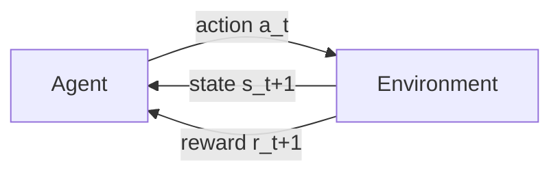

# Deep Reinforcement Learning (AIML ZG512) — Master Study Notes

> **Course:** AIML ZG512 · BITS Pilani WILP · **Faculty:** Prof. A. A. Nippun Kumaar
> **Notes updated:** 2026-09-16 · **Primary text:** Sutton & Barto, *Reinforcement Learning: An Introduction* (2nd ed.)
> **Status:** Living document — append new sessions under *"Update Log"* and extend the topic map.

## How to use this note
1. RL exams are **heavily numerical** — for every 🧮 formula, redo the ✍️ worked example by hand.
2. Memorize the **update rules** (bandit, Bellman, MC, TD, SARSA, Q-learning) — they are the exam.
3. Icons: 💡 intuition · 🧮 formula · ✍️ worked example · 🎯 exam · ⚠️ trap · 🔁 revision.

---

## 0. The Big Picture

**Reinforcement Learning = learning what to do — how to map situations to actions — to maximize a numerical reward signal, by trial and error.** No teacher gives the right answer; the agent discovers which actions yield the most reward by *trying* them.



- **Agent** = learner/decision-maker. **Environment** = everything outside. Interaction is in **discrete time steps**: agent takes action → environment returns new **state** + scalar **reward**. Objective: **maximize the expected return** (cumulative reward).
- **Vs other ML:** supervised = learn from labelled examples; unsupervised = find structure; **RL = learn from evaluative feedback (reward) under delay + its own actions changing future data.**
- **The two core challenges:**
  1. **Exploration vs Exploitation** — exploit known-good actions vs explore to find possibly-better ones.
  2. **Credit assignment / delayed reward** — which past action caused a later reward?
- **Reward Hypothesis** 🎯: *all goals can be described as maximizing expected cumulative reward.* ⚠️ Reward says **what** to achieve, not **how**. Mis-specified rewards get gamed (chess agent baited into traps; vacuum agent that dumps dirt to re-suck it).

### Syllabus / Topic map
| # | Module | Taught | Exam |
|---|--------|:---:|:---:|
| S1 | Intro to RL, agent–environment, exploration | ✅ | EC2 |
| S2–3 | **Multi-armed Bandits** (action-value, ε-greedy, UCB, optimistic init) | ✅ | EC2/EC3 |
| S4–6 | **MDPs** + reward design + Bellman + **Dynamic Programming** (policy/value iteration) | ✅ | EC2/EC3 |
| S7–8 | **Monte Carlo** (first-visit eval, ε-greedy control, off-policy / importance sampling) | ✅ | **EC2** |
| S9 | **Temporal-Difference** (TD(0), SARSA, Q-learning) | ✅ intro | EC2 intro / EC3 |
| — | **Function approximation** (linear, semi-gradient TD) | ▶ | EC3 |
| — | **Deep RL**: DQN, policy gradients, actor–critic | ▶ | later |

### 📋 Evaluation
- **EC2 – Mid-sem (30%, closed book):** ⚠️ **scope = Sessions 1–8 (up to Monte Carlo) + the very start of TD** — confirmed in the 6-Sep class (*"first 8 lectures, till temporal difference"*). Expect: bandits (UCB, ε-greedy), returns/discount, grid-world Bellman + optimal policy, **DP policy & value iteration**, and **first-visit Monte-Carlo value computation from supplied episodes**.
- **EC3 – Comprehensive (40%, open book):** bandits (sample-avg vs constant-step, UCB, optimistic init), **SARSA**, bootstrapping, Bellman expectation, **every-visit Monte Carlo**, off-policy / importance sampling, **linear function approximation / semi-gradient TD(0)**.

---

## S1–3 · Multi-Armed Bandits (the "one-state" RL problem) 🎯

**k-armed bandit:** repeatedly choose among $k$ actions; each returns a reward from a fixed (stationary) distribution depending on the action. Goal: maximize expected total reward. There's **no state transition** — it isolates the exploration/exploitation problem.

- **True value:** $q_{\ast}(a) = \mathbb{E}[R_t \mid A_t = a]$. **Estimate:** $Q_t(a)$. If we knew every $q_{\ast}(a)$, we'd just pick the max — the whole problem is *estimating* them.

### 1.1 Action-value estimation
- 🧮 **Sample-average:** $Q_n(a) = \dfrac{\text{sum of rewards when } a \text{ taken}}{\text{number of times } a \text{ taken}}$.
- 🧮 **Incremental update** (no need to store all rewards):
```math
Q_{n+1} = Q_n + \frac{1}{n}\,(R_n - Q_n).
```
General form: **NewEstimate ← OldEstimate + StepSize · (Target − OldEstimate)**.
- 🧮 **Constant step-size $\alpha$** (for **non-stationary** problems — values drift over time):
```math
Q_{n+1} = Q_n + \alpha\,(R_n - Q_n).
```
This is an **exponentially-weighted recency-weighted average** — recent rewards count more. ⚠️ **Exam judgment:** in *mutation-heavy / non-stationary* settings, **constant-α is superior** to sample-average (which averages in stale early data and stops adapting).

✍️ *Rewards 1, 0, 1, 1 with α = 0.5, Q₁ = 0:* Q₂=0+0.5(1−0)=0.5; Q₃=0.5+0.5(0−0.5)=0.25; Q₄=0.25+0.5(1−0.25)=0.625; Q₅=0.625+0.5(1−0.625)=0.8125.

### 1.2 Action selection strategies 🎯
- **Greedy:** $A_t = \arg\max_a Q_t(a)$ — pure exploitation, can get stuck.
- **ε-greedy:** with prob. $1-\varepsilon$ act greedily; with prob. $\varepsilon$ pick a **random** action (uniform over all $k$). Ensures every action sampled infinitely often → $Q_t(a)\to q_{\ast}(a)$.
  - 🧮 Probability of each action under ε-greedy:
```math
\pi(a) = \begin{cases} 1 - \varepsilon + \dfrac{\varepsilon}{k}, & a = \arg\max Q\\[2mm] \dfrac{\varepsilon}{k}, & \text{otherwise.}\end{cases}
```
  ✍️ *2 actions, ε = 0.5:* P(greedy) $= (1-0.5) + 0.5/2 = 0.75$. *(If it explores, P(specific arm) $=\varepsilon/k$.)*
- **Optimistic initial values:** set $Q_1(a)$ high (e.g. +5) → every action looks "disappointing" once tried → agent is *driven to explore* all arms early, even with greedy selection. ⚠️ Only helps **stationary** problems; it's a one-time exploration boost.
- **Upper Confidence Bound (UCB)** — explore by *potential*, not randomly:
```math
A_t = \arg\max_a \left[\, Q_t(a) + c\sqrt{\dfrac{\ln t}{N_t(a)}}\,\right].
```
The bonus is large for **rarely-tried** actions ($N_t(a)$ small) and shrinks as an action is explored. $c$ controls exploration.
  ✍️ *A tried 900×, B tried 10×, t=999, c=2:* B's exploration bonus $2\sqrt{\ln 999/10}\approx 2\sqrt{0.69}\approx1.66$ dwarfs A's $2\sqrt{\ln999/900}\approx0.176$ → **UCB favours the under-explored B** unless A's $Q$ is much higher.

> ⚠️ **When bandits break down:** if the reward depends on **context** (weather, traffic) the problem becomes a **contextual bandit / full MDP**, not a standard bandit — there is now *state*.

---

## S4–6 · Markov Decision Processes (MDPs) 🎯

An MDP is the formalism for **sequential** decision-making where actions affect future states.

### 2.1 Definition
An MDP is a tuple $\langle \mathcal S, \mathcal A, P, R, \gamma\rangle$:
- $\mathcal S$ states, $\mathcal A$ actions,
- **transition / model dynamics** $p(s'\mid s,a) = \Pr(S_{t+1}=s'\mid S_t=s, A_t=a)$,
- **reward** $r(s,a,s')$ (or $r(s,a)$),
- **discount** $\gamma\in[0,1]$, plus start (and maybe terminal) states.
- 🧮 **Markov property:** the future depends only on the *current* state, not the full history: $P(S_{t+1}\mid S_t,A_t) = P(S_{t+1}\mid S_0,A_0,\dots,S_t,A_t)$.
- 💡 Any goal-directed learning reduces to **three signals**: actions (choices), states (basis for choices), rewards (goal).

#### Known dynamics and stochastic movement
If $p(s'\mid s,a)$ and $r(s,a,s')$ are available, the environment's **model dynamics are known**. In the class grid world, an attempted move reaches its intended cell with probability $0.8$ and slips to either side with probability $0.1$ each. The action is deterministic at the command level, but the **transition is stochastic**.

The expected one-step reward must include those outcomes:
```math
\mathbb E[R_{t+1}\mid s,a]=\sum_{s'}p(s'\mid s,a)\,r(s,a,s').
```

⚠️ A terminal state can represent either successful termination (positive reward) or unsuccessful termination (negative reward). "Terminal" means the episode ends, not that the outcome was good.

#### Formulation case study: recycling robot
The live class used a battery-powered can-collecting robot to show that MDP design is a modelling decision, not just an algorithm choice.

| Part | Class formulation |
|---|---|
| States | battery `High` or `Low` |
| Actions at `High` | `Search`, `Wait` |
| Actions at `Low` | `Search`, `Wait`, `Recharge` |
| Goal | collect cans without exhausting the battery |
| Reward principle | $R_{search}>R_{wait}$ when searching is desirable; penalize risky low-battery behaviour |

Actions may therefore be **state-dependent**; every state does not need the same action set. If searching and waiting receive the same reward, the agent may learn to wait because waiting avoids battery cost while earning the same feedback. That is not an "unintelligent agent" — it is a loophole in the objective.

> 🎯 **Faculty debugging order:** when an RL agent learns the wrong behaviour, first audit the **state/action/reward formulation** (especially reward), then hyperparameters, and only then blame or replace the algorithm. Reward specifies what behaviour is profitable, including accidental shortcuts.

### 2.2 Returns & discounting 🎯
- **Return** = cumulative future reward. **Episodic** (has terminal $T$): $G_t = R_{t+1} + R_{t+2} + \dots + R_T$.
- **Continuing** ($T=\infty$): **discounted return**
```math
G_t = R_{t+1} + \gamma R_{t+2} + \gamma^2 R_{t+3} + \dots = \sum_{k=0}^{\infty}\gamma^k R_{t+k+1}.
```
- 🧮 **Recursive:** $G_t = R_{t+1} + \gamma\,G_{t+1}$.
- $\gamma = 0$ → **myopic** (only immediate reward); $\gamma \to 1$ → **far-sighted**. For constant reward +1, $G = 1/(1-\gamma)$ (finite when $\gamma<1$).

✍️ *Rewards $R_1{=}{-}1, R_2{=}2, R_3{=}6$, γ=0.5:* $G_0 = -1 + 0.5(2) + 0.25(6) = -1+1+1.5 = 1.5$; $G_1 = 2 + 0.5(6) = 5$.

### 2.3 Policy & value functions 🎯
- **Policy** $\pi(a\mid s)$ = probability of taking action $a$ in state $s$. Learning = improving $\pi$.
- 🧮 **State-value** (expected return from $s$ under $\pi$): $v_\pi(s) = \mathbb{E}_\pi[G_t \mid S_t = s]$.
- 🧮 **Action-value** (Q): $q_\pi(s,a) = \mathbb{E}_\pi[G_t \mid S_t = s, A_t = a]$.
- Linked: $v_\pi(s) = \sum_a \pi(a\mid s)\,q_\pi(s,a)$ and

```math
q_\pi(s,a)=\sum_{s'}p(s'\mid s,a)
\left[r(s,a,s')+\gamma v_\pi(s')\right].
```

Here $r(s,a,s')$ is the immediate reward received when action $a$ moves the agent from $s$ to $s'$. If a particular MDP's reward depends only on $s$ and $a$, write $r(s,a)$ instead, but keep that convention consistent.
- A policy can be **deterministic**, $\pi(s)=a$, or **stochastic**, $\pi(a\mid s)=P(A_t=a\mid S_t=s)$. Multiple actions can tie for optimality, so more than one optimal policy may exist.
- ⚠️ A state's value is **not its immediate reward**. It is the expected sum of future rewards from that state. After an agent collects a large transition reward, the destination can still have a lower value because that reward is already in the past.

### 2.4 Bellman equations (the heart of RL) 🎯
**Bellman Expectation Equation** — value = expected (immediate reward + discounted next-state value):
```math
v_\pi(s) = \sum_{a}\pi(a\mid s)\sum_{s'}p(s'\mid s,a)\Big[r(s,a,s') + \gamma\,v_\pi(s')\Big].
```

**Bellman Optimality Equation** — optimal value = value of the **best** action (max, not average):
```math
v_{\ast}(s)=\max_a\sum_{s'}p(s'\mid s,a)
\left[r(s,a,s')+\gamma v_{\ast}(s')\right],
```
```math
q_{\ast}(s,a)=\sum_{s'}p(s'\mid s,a)
\left[r(s,a,s')+\gamma\max_{a'}q_{\ast}(s',a')\right].
```

- **Optimal policy** $\pi_{\ast}$: $\pi \ge \pi'$ iff $v_\pi(s)\ge v_{\pi'}(s)\ \forall s$. At least one optimal policy always exists (may be several); once you have $v_{\ast}$, act greedily w.r.t. it.
- **Expectation vs optimality:** $v_\pi$ averages action returns using the current policy probabilities $\pi(a\mid s)$; $v_{\ast}$ takes the maximum because it asks for the best available action. Do not replace every expectation with a max: stochastic next-state outcomes are still averaged through $p(s'\mid s,a)$.
- ⚠️ **Adding a constant $c$ to all rewards** changes all values by $c/(1-\gamma)$ but **does not change the optimal policy** (in continuing tasks). In episodic tasks with varying episode lengths it *can* change behaviour.

✍️ **EC-style Bellman step:** state has two next states with a 40/60 policy split; going to $s_1$ gives reward $r_1$ + value $V_1$, to $s_2$ gives $r_2 + V_2$; with discount γ: $V(s) = 0.4\,[r_1 + \gamma V_1] + 0.6\,[r_2 + \gamma V_2]$.

### 2.5 Solving MDPs with Dynamic Programming (model known) 🎯
Requires the full model $p,r$. **Bootstrapping** means that an estimate is updated using another current estimate as part of its target. For example, $R+\gamma V(S')$ uses the present estimate $V(S')$; it is not a fully observed final return.

- **Policy Evaluation:** iterate the Bellman *expectation* backup until $v_\pi$ converges.
- **Policy Improvement:** make policy greedy w.r.t. $v_\pi$: $\pi'(s) = \arg\max_a q_\pi(s,a)$.
- **Policy Iteration:** alternate Evaluation ↔ Improvement until stable → $\pi_{\ast}$.
- **Value Iteration:** fold improvement into the backup — iterate the Bellman *optimality* backup directly:
```math
V_{k+1}(s)\leftarrow\max_a\sum_{s'}p(s'\mid s,a)
\left[r(s,a,s')+\gamma V_k(s')\right].
```
Read this from the inside out: for one action $a$, calculate “immediate reward + discounted old value” for every possible next state $s'$, average those outcomes with $p(s'\mid s,a)$, then choose the action with the largest result.

**Stopping check:** a practical DP loop stops when the largest value change in a sweep is below a chosen tolerance, $\max_s|V_{k+1}(s)-V_k(s)|<\theta$. A small update is evidence of numerical convergence only when the implementation still performs valid backups. Flat values caused by a broken reward, unreachable transitions, or a coding/formulation error are **stagnation**, not proof of optimality.

| | Policy Iteration | Value Iteration |
|--|------------------|-----------------|
| Inner loop | full policy evaluation to convergence | one Bellman-optimality sweep |
| Iterations | few (each expensive) | many (each cheap) |
| Converges to | $\pi_{\ast}$ | $v_{\ast}$ then extract $\pi_{\ast}$ |

#### 🧮 Worked value iteration — the **race-car** MDP (S#4–6, hand-calculated in class) 🎯
States **Cool, Warm, Overheated** (terminal); actions **Slow, Fast**; $\gamma=0.9$. Rewards/transitions:

| State | Action | Next (prob) | Reward |
|-------|--------|-------------|:------:|
| Cool | Slow | Cool (1.0) | +1 |
| Cool | Fast | Cool (0.5), Warm (0.5) | +2 |
| Warm | Slow | Cool (0.5), Warm (0.5) | +1 |
| Warm | Fast | Overheated (1.0) | −10 |
| Overheated | — | terminal | 0 |

The reward in the table is received **once when the action is taken**, before the discounted value of the resulting state is added. Initialize
```math
V_0(\text{Cool})=V_0(\text{Warm})=V_0(\text{Overheated})=0.
```

**Sweep 1, state Cool:**
```math
Q_0(\text{Cool,Slow})=1+0.9V_0(\text{Cool})=1,
```
```math
\begin{aligned}
Q_0(\text{Cool,Fast})
&=0.5[2+0.9V_0(\text{Cool})]+0.5[2+0.9V_0(\text{Warm})]\\
&=0.5(2)+0.5(2)=2.
\end{aligned}
```
Therefore $V_1(\text{Cool})=\max(1,2)=2$, so Fast is preferred.

**Sweep 1, state Warm:**
```math
Q_0(\text{Warm,Slow})=0.5(1)+0.5(1)=1,
\qquad Q_0(\text{Warm,Fast})=-10.
```
Therefore $V_1(\text{Warm})=1$, so Slow is preferred. The terminal value stays 0:
```math
V_1=[2,1,0].
```

**Sweep 2 uses the old values $V_1$, not partially updated $V_2$ values:**
```math
Q_1(\text{Cool,Slow})=1+0.9(2)=2.8,
```
```math
Q_1(\text{Cool,Fast})=0.5[2+0.9(2)]+0.5[2+0.9(1)]=1.9+1.45=3.35,
```
so $V_2(\text{Cool})=3.35$. Similarly,
```math
Q_1(\text{Warm,Slow})=0.5[1+0.9(2)]+0.5[1+0.9(1)]=1.4+0.95=2.35,
```
while Fast gives $-10$, so $V_2(\text{Warm})=2.35$. Thus
```math
V_2=[3.35,2.35,0].
```
Keep sweeping until $\max_s|V_{k+1}(s)-V_k(s)|<\theta$.

⚠️ **Terminal states never get a value update** — $V(\text{Overheated})=0$ always (no action, no successor). ⚠️ In the **grid-world** variant, actions are *noisy* (intended dir 0.8, each perpendicular 0.1); a move **into a wall keeps the agent in the same cell**, and wall cells are **not states**, so they carry no value.

#### ⚠️ Six practical issues of Value Iteration (why we move to model-free / Q / policy-gradient) 🎯
1. **Synchronous update** — every sweep recomputes *all* states from the previous sweep (in-place/**asynchronous** updates can converge faster).
2. **Policy is not free** — after values converge you still need a **separate full sweep** of $\arg\max_a$ to read off $\pi_{\ast}$.
3. **Policy converges long before values** 🔁 — the best *action* per state usually stabilizes many iterations before the *numbers* do; if you only need $\pi_{\ast}$, you can stop early.
4. **Needs the model** — full $p(s'\mid s,a)$ **and** $r$ must be known; often they are not → **model-free** MC/TD.
5. **Discrete, finite actions only** — continuous actions (e.g. throttle 0–100%) break the explicit $\max_a$ → **policy-gradient**.
6. **Infeasible for large/continuous state spaces** — the table blows up → **function approximation / generalization**.

💡 **Q-values fix issue #2.** Because $Q(s,a)$ already ranks *actions*, learning $Q_{\ast}$ gives the policy for free: $\pi_{\ast}(s)=\arg\max_a Q_{\ast}(s,a)$ — **no extra sweep**. The bridge both ways:
```math
V_{\ast}(s)=\max_a Q_{\ast}(s,a),\qquad
Q_{\ast}(s,a)=\sum_{s'}p(s'\mid s,a)
\left[r(s,a,s')+\gamma V_{\ast}(s')\right].
```
This is exactly why **Q-learning** (next module) is attractive. ⚠️ **Reward loops:** if an agent cycles between two cells to farm reward, the bug is the **reward design**, not the algorithm — a small **negative step reward** (living penalty) removes the incentive to loiter.

#### 🧮 Worked **policy iteration** — same race-car MDP (6-Sep class) 🎯
Value iteration folds the $\max$ into every backup; **policy iteration keeps the two steps separate** — evaluate a *fixed* policy fully, then improve it once. Start from an arbitrary $\pi_0=\{\text{Cool}:\text{Slow},\ \text{Warm}:\text{Slow}\}$ ($\gamma=0.9$).

1. **Policy evaluation** (no $\max$ — just follow $\pi_0$): solve $v_{\pi_0}$ using either of two methods.
  - **Method A, iterative evaluation (the class algorithm):** start from $V_0=0$ and repeatedly apply the Bellman expectation backup for the fixed Slow/Slow policy. About 46 synchronous sweeps reached tolerance 0.01.
  - **Method B, solve the fixed-point equations directly (an algebra shortcut):**

```math
v(\text{Cool})=1+0.9v(\text{Cool})
\Rightarrow 0.1v(\text{Cool})=1
\Rightarrow v(\text{Cool})=10.
```

Substitute this into Warm's equation:

```math
\begin{aligned}
v(\text{Warm})
&=0.5[1+0.9(10)]+0.5[1+0.9v(\text{Warm})]\\
&=5+0.5+0.45v(\text{Warm}).
\end{aligned}
```

Therefore $0.55v(\text{Warm})=5.5$ and $v(\text{Warm})=10$. Both methods reach the same fixed point; they are two ways to perform policy evaluation, not two different algorithms.
2. **Policy improvement** (one $\arg\max$ sweep):
   - Cool: $Q(\text{Slow})=1+0.9(10)=10$ vs $Q(\text{Fast})=0.5(2{+}0.9\cdot10)+0.5(2{+}0.9\cdot10)=\mathbf{11}$ → **switch Cool → Fast**.
   - Warm: $Q(\text{Slow})=0.5(1{+}9)+0.5(1{+}9)=10$ vs $Q(\text{Fast})=-10$ → **keep Warm at Slow**.
   - $\pi_1=\{\text{Cool}:\text{Fast},\ \text{Warm}:\text{Slow}\}$; evaluate → improve again until the policy stops changing.

🔁 **The exam insight the class kept returning to:** *the policy converges before the values do.* The action choice $\{\text{Cool:Fast, Warm:Slow}\}$ stabilizes many sweeps before the numbers stop moving, so **checking for a stable policy (not a stable value) lets you stop early**. VI never checks this, which is why it "wastes" iterations after the policy is already optimal. The **only** difference in the evaluation step between VI and PI is the $\max$.

---

## Monte Carlo Methods (model-free, learn from complete episodes) 🎯

**The twist that starts MC:** take the race-car MDP and **erase the arrows** — no transition probabilities, no reward function. You know only the **states, the actions, and an environment you can play in**. Can you still find the best policy? Yes — *sample* whole episodes and learn from the **returns the environment actually hands back** (like a child learning to walk with no built-in model).

> ⚠️ **Assumption for the MC algorithms in this note:** each sampled episode terminates, because the update waits for the complete realised return $G_t$. Continuing tasks need a defined truncation/regeneration scheme or a method such as TD that can update before termination. MC does **not** bootstrap from a current value estimate.

- **MC prediction:** $V(s)=$ average of returns $G_t$ observed after visiting $s$.
  - **First-visit MC:** average the return following the *first* time $s$ appears in each episode.
  - **Every-visit MC:** average the return following *every* visit to $s$.
- **MC control:** estimate $q_\pi(s,a)$, then improve **ε-greedily** (explore ε of the time, exploit the rest).

#### 🧮 Worked **first-visit MC evaluation** — grid world (6-Sep class, exam-style) 🎯
States **A B C D E**; **A** and **D** are terminal (exit only). Fixed policy $\pi$: **B→East, C→East, E→North**; every transition pays the **step reward −1**, exiting **D = +10**, exiting **A = −10**; $\gamma=1$. Four observed episodes:

| Ep | Trajectory (transition → reward) | Note |
|---|---|---|
| 1 | B→C(−1), C→D(−1), D exit(+10) | |
| 2 | B→C(−1), C→D(−1), D exit(+10) | same as Ep1 |
| 3 | E→C(−1), C→D(−1), D exit(+10) | starts at E |
| 4 | E→C(−1), C→**A**(−1), A exit(−10) | C "slipped" to A (noisy move) |

First-visit return = sum of rewards from the state's first occurrence to the end of that episode ($\gamma=1$), then average over the episodes that contain the state:

| State | First-visit returns | $V$ |
|---|---|:--:|
| **B** | $8,\ 8$ | $(8+8)/2=\mathbf{8}$ |
| **C** | $9,\ 9,\ 9,\ -11$ | $(27-11)/4=\mathbf{4}$ |
| **E** | $8,\ -12$ | $(8-12)/2=\mathbf{-2}$ |
| **D** | $+10,\ +10,\ +10$ | $30/3=\mathbf{10}$ |
| **A** | $-10$ | $-10/1=\mathbf{-10}$ |

⚠️ **Why $V(B){=}{+}8$ but $V(E){=}{-}2$ when both funnel into C?** This is the *weakness of MC evaluation* the professor flagged: MC **learns every state separately and ignores the shared transition structure**, so with few episodes two states that reach the same successor can still get very different values. MC is easy and model-free but **data-hungry and slow** — it "wastes information about transition probabilities." (Thousands of episodes make them converge.)

💡 **Exam tip (said explicitly):** a question will *give you the episodes and their rewards*; your job is to average the first-visit returns per state. If the episode outcomes aren't supplied, first-visit MC can't be computed.

#### 🎲 Exploration & ε-greedy MC control 🎯
A separate robot grid (terminals **U**=+1, **Y**=+10, **Z**=−1; intermediates **W, X**) starts from an all-zero $Q$-table and fills it in **only along the states it actually visits**. With limited exploration it can lock onto a **local optimum** (e.g. W→U for +1) and miss the **global** one (…→Y for +10). Fix = **ε-greedy**: with prob. ε take a non-greedy (exploratory) action, with prob. 1−ε exploit the current best — the same ε-greedy trade-off from bandits, now inside MC control.

#### 🔀 Off-policy MC & importance sampling 🎯
Learn a **target** policy $\pi$ while behaving with an exploratory **behaviour** policy $b$ (needs *coverage*: $b(a\mid s)>0$ wherever $\pi(a\mid s)>0$). Reweight each sampled return by the **importance-sampling ratio** $\rho=\prod_t \dfrac{\pi(a_t\mid s_t)}{b(a_t\mid s_t)}$.

🧠 **Why two policies?** $b$ is the data collector: it explores, reuses old logs, or follows a demonstrator. $\pi$ is the policy whose value you want and eventually improve. The transition probabilities cancel from the trajectory-probability ratio, so the correction needs the two **action probabilities**, not a known environment model.

**Coverage is non-negotiable:** if $\pi(a\mid s)>0$, then $b(a\mid s)>0$. Otherwise the target may choose an action the behaviour policy never samples, leaving no evidence from which to estimate that part of $\pi$. A deterministic target against a 50/50 behaviour policy gives a fast mental check: one target-inconsistent action makes the remaining trajectory ratio **zero**; each matching action contributes $1/0.5=2$, so long matching suffixes can create enormous weights and variance.

Do not confuse two different cases:
- **Coverage failure:** $\pi(a\mid s)>0$ but $b(a\mid s)=0$. The target uses an action that can never appear in the data, so its value is not estimable from that behaviour policy.
- **Zero ratio on a sampled trajectory:** $b(a\mid s)>0$ but a deterministic target has $\pi(a\mid s)=0$. The sample is valid behaviour data, but it is irrelevant to that deterministic target, so its target-policy weight is zero.

| | Ordinary IS | Weighted IS |
|--|-------------|-------------|
| Estimate | $\frac1N\sum \rho\,G$ | $\dfrac{\sum \rho\,G}{\sum \rho}$ |
| Bias | **unbiased** | biased (vanishes with data) |
| Variance | **high** (can be unbounded) | **bounded** (preferred in practice) |

**Why variance grows:** $\rho$ is a product. If each target-consistent action contributes $1/0.5=2$, a matching suffix of length $T$ receives weight $2^T$; at $T=10$, that is $1024$. Ordinary IS lets one such trajectory dominate. Weighted IS divides by the total weight, trading a finite-sample bias for much greater stability.

**Weighted off-policy MC control, backwards through one episode:**
1. Initialise return $G=0$ and weight $W=1$; process the episode from the final transition backwards.
2. Update $G\leftarrow\gamma G+R_{t+1}$.
3. Accumulate evidence $C(S_t,A_t)\leftarrow C(S_t,A_t)+W$.
4. Update $Q(S_t,A_t)\leftarrow Q(S_t,A_t)+\dfrac{W}{C(S_t,A_t)}[G-Q(S_t,A_t)]$.
5. Make the target policy greedy with respect to updated $Q$: $\pi(S_t)=\arg\max_a Q(S_t,a)$. This algorithm therefore uses a **deterministic** target.
6. Compute the one-step ratio $\pi(A_t\mid S_t)/b(A_t\mid S_t)$. If $A_t\ne\pi(S_t)$, then $\pi(A_t\mid S_t)=0$; **break** because all earlier suffix weights would become zero. This is a zero target ratio, not a coverage failure.
7. Otherwise $\pi(A_t\mid S_t)=1$, so update $W\leftarrow W/b(A_t\mid S_t)$. For a stochastic target, use the general update $W\leftarrow W\,\pi(A_t\mid S_t)/b(A_t\mid S_t)$ and stop only if that ratio is zero.

> ⚠️ **Three distinct objects:** $G$ is the discounted reward from this visit; $W$ says how representative that suffix is for the target policy; $C$ is cumulative weight/evidence. Do not call $C$ a visit count unless all weights happen to be one.

#### How to recognise a Monte Carlo question
| Trigger in the question | What to do first | Why | Common trap |
|---|---|---|---|
| complete episodes supplied | work backwards to calculate $G_t$ | MC uses realised returns | bootstrapping from $V(S_{t+1})$ |
| "first visit" | retain one return per state per episode | repeated visits in that episode are ignored | averaging every occurrence |
| "every visit" | retain every occurrence's return | each visit is a sample | averaging episode totals only |
| same policy generates and learns | on-policy | $b=\pi$, no correction | inventing importance weights |
| data from $b$, estimate $\pi$ | off-policy + $\rho$ | trajectory distributions differ | using raw returns directly |
| improve action choices | estimate $Q(s,a)$, not only $V(s)$ | control must compare actions | trying to derive an action from state value alone |

✍️ **Every-visit MC (EC3 "library" style):** for each episode compute the discounted return from the target state at each visit, then **average across all visits** to get $V$. E.g. return from "Overdue": $G = r_0 + \gamma r_1 + \gamma^2 r_2 + \dots$; average the episodes' returns.

### Previous-paper decision map 🎯
- **EC2 (30 marks):** UCB + ε-greedy + "does context still fit a bandit?" (10); discounted returns (5); grid-world Bellman expectation then optimal policy/value (10); derive Bellman expectation and optimality (5).
- **EC3 (40 marks):** non-stationary bandit updates, ε-greedy probability, optimistic initialisation and UCB (12); sequential SARSA updates + bootstrapping judgment (8); one Bellman-expectation update + every-visit MC (10); linear gradient-MC and semi-gradient TD(0) weight updates (10).

> 🧠 **Algorithm selector:** known $p,r$ and asked to sweep all states → DP. Unknown model plus complete episodes → MC. A transition arrives and an immediate update is required → TD. Actual next action in the target → SARSA. Best next action in the target → Q-learning. Features/weights instead of a table → function approximation.

---

## Temporal-Difference (TD) Learning ⭐🎯

**TD = Monte Carlo + Dynamic Programming.** Learns from experience (model-free, like MC) **but bootstraps** (updates from estimates, like DP) → can learn **online, from incomplete episodes**.

**Solving MDPs — the three families side by side** (the "what changed" slide):

| | Model-free? | Bootstraps? | Needs full episode? | Online? |
|--|:--:|:--:|:--:|:--:|
| **Dynamic programming** | ❌ needs model | ✅ (from neighbours) | ❌ | ❌ |
| **Monte Carlo** | ✅ | ❌ (uses real $G_t$) | ✅ | ❌ |
| **TD learning** | ✅ | ✅ | ❌ (updates every step) | ✅ |

- 🧮 **TD(0) prediction:** $V(S_t) \leftarrow V(S_t) + \alpha\big[\underbrace{R_{t+1} + \gamma V(S_{t+1})}_{\text{TD target}} - V(S_t)\big]$. The bracket is the **TD error** $\delta_t$.
- **Bootstrapping** = the target uses the *current estimate* $V(S_{t+1})$ (present in DP & TD, **absent** in MC).

### 4.1 SARSA — on-policy control 🎯
Update using the action **actually taken** next ($S,A,R,S',A'$):
```math
Q(S_t,A_t) \leftarrow Q(S_t,A_t) + \alpha\big[R_{t+1} + \gamma\,Q(S_{t+1}, A_{t+1}) - Q(S_t,A_t)\big].
```

### 4.2 Q-learning — off-policy control 🎯
Update using the **best** next action (max), regardless of what was actually taken:
```math
Q(S_t,A_t) \leftarrow Q(S_t,A_t) + \alpha\big[R_{t+1} + \gamma \max_{a'} Q(S_{t+1}, a') - Q(S_t,A_t)\big].
```

| | SARSA (on-policy) | Q-learning (off-policy) |
|--|-------------------|-------------------------|
| Target uses | $Q(S',A')$ — actual next action | $\max_a Q(S',a)$ — greedy |
| Learns | value of the policy it follows (incl. exploration) | value of the optimal policy |
| Behaviour | "safer" near cliffs (accounts for exploration) | more aggressive/optimal |

✍️ **SARSA numeric (EC3):** apply the update along a given trajectory in order; with α and γ given, each transition nudges $Q(S,A)$ toward $R + \gamma Q(S',A')$. **Yes, bootstrapping influences it** — the target contains the estimate $Q(S',A')$.

- **Expected SARSA:** replace $Q(S',A')$ with $\sum_{a}\pi(a\mid S')Q(S',a)$ (lower variance).

---

## Function Approximation (scaling to large/continuous states) 🎯

Tabular RL fails when states are huge/continuous → represent $\hat v(s,\mathbf w) = \mathbf w^\top \mathbf x(s)$ with a **feature vector** $\mathbf x(s)$ and weights $\mathbf w$ (linear case).

- 🧮 **Semi-gradient TD(0) update:**
```math
\mathbf w \leftarrow \mathbf w + \alpha\big[\underbrace{R + \gamma\,\hat v(S',\mathbf w)}_{\text{TD target}} - \hat v(S,\mathbf w)\big]\,\nabla_{\mathbf w}\hat v(S,\mathbf w),
```
and for **linear** $\hat v$, $\nabla_{\mathbf w}\hat v(S,\mathbf w) = \mathbf x(S)$.
- "**Semi**-gradient" = we ignore the dependence of the target on $\mathbf w$ (don't differentiate through $\hat v(S')$).
- **Gradient MC** version: target is the actual return $G_t$ instead of the TD target.

✍️ **EC3 linear-FA:** current value $\hat v(S) = \mathbf w^\top\mathbf x(S)$. **MC update:** $\mathbf w \leftarrow \mathbf w + \alpha(G - \hat v(S))\mathbf x(S)$. **TD update:** compute **TD target** $R + \gamma\,\mathbf w^\top\mathbf x(S')$, then $\mathbf w \leftarrow \mathbf w + \alpha(\text{target} - \mathbf w^\top\mathbf x(S))\,\mathbf x(S)$.

---

## Deep RL (the "Deep" in DRL) — course direction

Replace tables/linear features with **neural networks** as function approximators.
- **DQN (Deep Q-Network):** NN approximates $Q(s,a;\theta)$ from raw input (e.g. Atari pixels). Key tricks: **experience replay** (break correlation, reuse data) + a **target network** (stable targets) + the Q-learning loss $\big(R + \gamma\max_{a'}Q(s',a';\theta^-) - Q(s,a;\theta)\big)^2$.
- **Policy Gradient (REINFORCE):** directly parameterize $\pi_\theta(a\mid s)$ and ascend $\nabla_\theta J = \mathbb{E}[\nabla_\theta \log \pi_\theta(a\mid s)\,G_t]$. Good for continuous/stochastic actions.
- **Actor–Critic:** **actor** updates the policy, **critic** estimates value to reduce variance (advantage $A = Q - V$). Basis for A2C/A3C, PPO, DDPG, SAC.

---

## � Practical: OpenAI **Gymnasium** (webinar) 🎯

The webinar implemented RL *elements* (no learning algorithm yet) in **Gymnasium** (the maintained successor to OpenAI Gym) — a library of ready-made environments.
- `pip install gymnasium pygame`; `env = gym.make("MountainCar-v0")`; the registry lists every environment.
- **Standard loop:** `obs, info = env.reset()` → `obs, reward, terminated, truncated, info = env.step(action)` → `env.close()`.
- **MountainCar-v0:** **state** = (position ∈ [−1.2, 0.6], velocity ∈ [−0.07, 0.07]); **3 actions** = push-left / no-op / push-right; **reward −1 every step** until the flag is reached or 200 steps elapse (so the agent is pushed to finish quickly).
- **Hand-coded heuristic** (pure exploration, no learning): if velocity < 0 push **left**, else push **right** → builds momentum and reaches the flag far sooner than random actions. 💡 makes *state → action → reward → next-state* concrete before any algorithm.
- **CartPole-v1** is the other classic: balance a pole, +1 reward per timestep alive.

---

## �🧠 One-Page Cheat Sheet
- **RL:** maximize expected return via trial-and-error; core tensions = exploration/exploitation + delayed credit. Reward hypothesis: goals = max E[Σreward].
- **Bandit update:** $Q_{n+1}=Q_n+\alpha(R_n-Q_n)$; $\alpha=1/n$ sample-avg, constant $\alpha$ for **non-stationary**.
- **ε-greedy:** P(greedy)$=1-\varepsilon+\varepsilon/k$, P(other)$=\varepsilon/k$. **UCB:** $Q(a)+c\sqrt{\ln t/N(a)}$. **Optimistic init** forces early exploration (stationary only).
- **Return:** $G_t=\sum_k\gamma^kR_{t+k+1}=R_{t+1}+\gamma G_{t+1}$; γ=0 myopic, γ→1 far-sighted.
- **MDP formulation:** specify $S,A,p,r,\gamma$; actions may depend on state. Known $p,r$ = known model. Audit reward loopholes before changing algorithms.
- **Values:** $v_\pi(s)=E_\pi[G_t|s]$, $q_\pi(s,a)=E_\pi[G_t|s,a]$, $v_\pi(s)=\sum_a\pi(a|s)q_\pi(s,a)$.
- **Bellman expectation:** $v_\pi(s)=\sum_a\pi(a|s)\sum_{s'}p(s'|s,a)[r(s,a,s')+\gamma v_\pi(s')]$. **Optimality:** replace $\sum_a\pi$ with $\max_a$.
- **Value ≠ immediate reward:** value looks forward. Expectation averages the current policy; optimality selects the best action but still averages stochastic outcomes.
- **DP:** policy iteration (eval↔improve), value iteration (max backup). Needs model. **Bootstraps.**
- **Race-car VI (γ=0.9):** $V_0=[0,0,0]\to V_1=[2,1,0]\to V_2=[3.35,2.35,0]$; terminal value stays 0; a move into a wall keeps you in the same cell and walls are not states.
- **6 VI issues:** synchronous sweeps · policy needs a separate $\arg\max$ sweep · **policy converges before values** · needs the model · discrete finite actions only · large states → function approx. **Q fixes the policy issue:** $\pi_{\ast}(s)=\arg\max_a Q_{\ast}(s,a)$, $V_{\ast}(s)=\max_a Q_{\ast}(s,a)$.
- **Gymnasium:** `reset()/step()/close()`; MountainCar state=(pos,vel), 3 actions, −1/step; heuristic = push toward current velocity.
- **MC:** average actual returns; needs full episodes; **no bootstrap**. First-visit vs every-visit. *Recipe:* per state, sum rewards from its **first occurrence to episode end**, then average over episodes (worked grid: $V_B{=}8,V_C{=}4,V_E{=}{-}2,V_D{=}10,V_A{=}{-}10$). **Off-policy MC:** reweight returns by $\rho=\prod\pi/b$ — ordinary IS unbiased/high-variance, weighted IS biased/bounded.
- **Policy iteration:** evaluate a *fixed* policy (no $\max$) → improve by $\arg\max$ → repeat. **Policy converges before the values → stop when the policy stops changing.**
- **TD(0):** $V(S)\!\leftarrow\!V(S)+\alpha[R+\gamma V(S')-V(S)]$. **SARSA** (on-policy, $Q(S',A')$) vs **Q-learning** (off-policy, $\max_a Q(S',a)$).
- **Linear FA semi-gradient TD:** $\mathbf w\!\leftarrow\!\mathbf w+\alpha[R+\gamma\mathbf w^\top\mathbf x(S')-\mathbf w^\top\mathbf x(S)]\mathbf x(S)$.
- **Deep RL:** DQN (replay + target net), REINFORCE (policy gradient), Actor–Critic (advantage).

**Method map:** DP = model + bootstrap; MC = sample + no bootstrap; **TD = sample + bootstrap** (best of both).

---

## ✅ Self-Test (cover the answers)
1. Compute $Q_5$ for rewards 1,0,1,1 with (a) sample-average, (b) α=0.5. Which is better under non-stationarity?
2. ε-greedy, k=4, ε=0.1: P(greedy)? P(a specific non-greedy arm)?
3. Given counts $N(a)$ and estimates $Q(a)$, compute UCB scores and pick the next arm.
4. Write returns $G_0, G_1$ for a reward sequence with γ=0.5.
5. State the Bellman **expectation** and **optimality** equations for $v$; explain the difference (average vs max).
6. One Bellman-expectation value update for a 2-successor state with a 40/60 policy.
7. Contrast **policy iteration** vs **value iteration**.
8. Run every-visit **Monte Carlo** on a 2-episode example; compute the average discounted return.
9. Apply **SARSA** along a trajectory; does bootstrapping affect the updates? *(Yes.)*
10. Given features + weights, compute the **TD target** and one **semi-gradient TD(0)** weight update.
11. SARSA vs Q-learning: on-policy vs off-policy — what does each target use?
12. Formulate the recycling robot as an MDP. Why must $R_{search}>R_{wait}$ in the high-battery state?
13. In a grid action with probabilities 0.8 intended, 0.1 left, 0.1 right, compute the expected one-step reward from three supplied outcomes.
14. Why can a destination have lower $V(s)$ immediately after receiving a +10 transition reward? *(The reward has already been collected; the destination value measures future return.)*
15. Run **two value-iteration sweeps** on the race-car MDP (γ=0.9) and confirm $V_1=[2,1,0]$, $V_2=[3.35,2.35,0]$; name the chosen action per state. *(Cool→Fast, Warm→Slow, Overheated terminal.)*
16. Give **three reasons** value iteration is impractical for a self-driving car's continuous throttle, and the family that fixes each. *(Continuous actions→policy gradient; unknown model→model-free MC/TD; huge state→function approximation.)*
17. Why does learning **$Q(s,a)$** remove the separate policy-extraction sweep? *(π\* = argmax_a Q\*; Q already ranks actions, so no extra sweep.)*
18. In MountainCar, why does "push in the direction of current velocity" work? *(It pumps energy/builds momentum to climb the hill within the step budget.)*
19. An agent oscillates between two cells farming reward. Is this an algorithm bug? *(No — a reward-design flaw; add a negative step reward.)*
20. **First-visit MC:** given the four grid episodes above, compute $V(B),V(C),V(E),V(D),V(A)$. *(8, 4, −2, 10, −10.)*
21. Both B and E lead into C, yet $V(B)=8$ and $V(E)=-2$. What limitation of MC does this expose? *(It evaluates each state separately and ignores shared transition structure → slow / data-hungry.)*
22. In **policy iteration**, why can you stop before the values converge? **Answer:** The greedy policy usually stabilizes first; once $\arg\max$ stops changing, $\pi$ is optimal even if the numbers still move.
23. Ordinary vs weighted **importance sampling** for off-policy MC: which is unbiased, which has bounded variance? *(Ordinary = unbiased / high-variance; weighted = biased / bounded-variance.)*

---

## 📈 How to extend this note
Append a dated `### Update Log — YYYY-MM-DD` below per session; add rows to the Syllabus map. Likely upcoming: n-step & TD(λ)/eligibility traces, DQN variants (Double/Dueling/PER), policy-gradient methods (REINFORCE→A2C→PPO), continuous control (DDPG/SAC), exploration methods, model-based RL.

## Update Log
- **2026-09-16** — Audited mathematical readability and correctness. Standardized transition-dependent reward notation, defined bootstrapping, expanded the race-car Bellman backups, separated iterative from exact policy evaluation, and clarified episodic MC, importance-sampling variance, coverage and the deterministic-target break rule.
- **2026-09-12** — Integrated the 12-Sep lecture and exact EC2/EC3 papers. Expanded MC control into an evaluation→improvement loop; separated behaviour $b$ from target $\pi$; added coverage, trajectory-ratio intuition, the backward weighted-importance-sampling algorithm ($G,W,C,Q$, greedy update and break condition), a question-recognition table, an algorithm selector, and paper-derived marks/topic maps. Confirmed the lecturer's explicit EC2 endpoint: through off-policy MC/importance sampling.
- **2026-09-06** — Folded in the 6-Sep live class + the freshly-shared Session 1–9 slide decks and Tutorial. Added a **worked policy-iteration** pass on the race-car MDP (evaluate fixed $\pi_0$=Slow/Slow → $v=10$ → improve to Cool:Fast/Warm:Slow) with the class's key insight that **the policy converges before the values**; a **worked first-visit Monte-Carlo** grid example (the professor's exam-style A–E episodes → $V=8,4,-2,10,-10$) with the "B vs E" weakness-of-MC point; **ε-greedy MC control / exploration** (local-optimum robot grid); **off-policy MC & importance sampling** (ordinary vs weighted); and a **DP / MC / TD** comparison table. **Corrected the exam scope: EC2 mid-sem now runs up to Monte Carlo + the intro to TD** (Sessions 1–8) — syllabus map and Evaluation updated. Added cheat-sheet and self-test items.
- **2026-09-03** — Added the 2026-08-30 value-iteration class and the RL webinar: a fully hand-worked **race-car** value-iteration example ($V_1=[2,1,0]$, $V_2=[3.35,2.35,0]$, γ=0.9), grid-world noisy transitions and wall handling, the **six practical limitations** of value iteration, the **Q-value bridge** to Q-learning ($\pi_{\ast}=\arg\max_a Q_{\ast}$), reward-loop diagnosis, and an **OpenAI Gymnasium** (MountainCar/CartPole) practical primer. Added cheat-sheet and self-test items.
- **2026-08-24** — Structured the MDP continuation from the 2026-08-23 live class: known stochastic dynamics, expected rewards, successful vs unsuccessful terminal states, the recycling-robot state/action/reward formulation, reward loopholes, ordinary vs optimal values, multiple optimal actions, and convergence-versus-stagnation checks.
- **2026-08-18** — Initial note from Sessions 1–6 (intro, multi-armed bandits, MDPs, dynamic programming), class transcripts, and EC2/EC3 papers. Extended with Monte Carlo, TD/SARSA/Q-learning, function approximation, and deep-RL directions to match exam scope.
