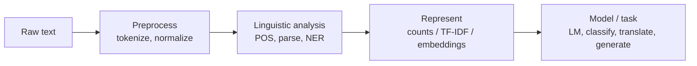
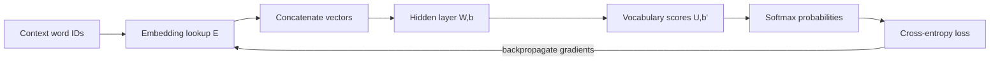
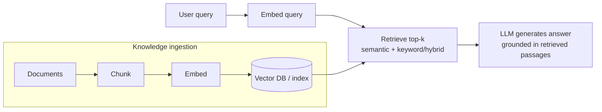
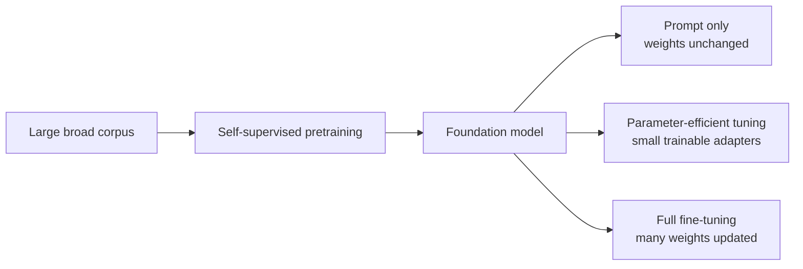

# Natural Language Processing (AIML ZG530) — Master Study Notes

> **Course:** AIML ZG530 · BITS Pilani WILP · **Faculty:** Prof. Chandra Prakash Manglani
> **Notes updated:** 2026-09-16 · **Primary text:** Jurafsky & Martin, *Speech and Language Processing* (3rd ed. draft)
> **Status:** Living document — append new sessions under *"Update Log"* and extend the topic map.

## How to use this note
1. NLP exams mix **concept** questions with **numerical** ones (TF-IDF, cosine, bigram+Laplace, Forward/Viterbi, PCFG). Redo every ✍️ worked example by hand.
2. Icons: 💡 intuition · 🧮 formula · ✍️ worked example · 🎯 exam · ⚠️ trap · 🔁 revision.

---

## 0. The Big Picture

**NLP = getting computers to understand, interpret, and generate human language.** The central difficulty is **ambiguity** — the same string has many meanings at every level:
- *Lexical:* "bank" (river vs money). *Syntactic:* "I saw the man with the telescope." *Semantic/Referential:* what does "it" refer to?

### Levels of language analysis (S1 recap) 🎯
Think bottom-up: **morpheme → word → sentence structure → literal meaning → situated meaning → connected text**.

| Level | Question it answers | Example |
|---|---|---|
| Morphological | How is the word built from meaning units? | `friend` + `-ly` |
| Lexical | Is the word valid, and which word/sense is it? | `friendship` is valid; `bank` has several senses |
| Syntactic | How do words combine and attach? | "girl with binoculars" has two attachment parses |
| Semantic | What literal, context-independent meaning results? | "Green ideas have large noses" is grammatical but anomalous |
| Pragmatic | What does it mean in this situation and with this intent? | "Can you pass the salt?" is a request, not an ability test |
| Discourse | How do nearby sentences affect interpretation? | "Chetana completed her PhD. She..." resolves `She` |

⚠️ **Ambiguity recognition:** two possible **word senses** means lexical ambiguity (`bats`); two possible **parse/attachment structures** means structural ambiguity (`saw a girl with binoculars`). State both readings, not merely the label.



**Task landscape:** classification (sentiment, spam) · sequence labeling (POS, NER) · language modeling / generation · machine translation · summarization · question answering / RAG · WSD.

### Syllabus / Topic map
| # | Module | Taught | Exam |
|---|--------|:---:|:---:|
| S1 | Intro, applications, ambiguity, morphology | ✅ | — |
| — | Text preprocessing: tokenization, stemming, lemmatization, regex, edit distance | ✅ | EC2 |
| — | **POS tagging**: HMM, Forward, Viterbi | ✅ | EC2/EC3 |
| S4 | **N-gram language models**, smoothing, perplexity | ✅ | EC2/EC3 |
| S2 | **Vector semantics**: BoW, **TF-IDF**, cosine | ✅ | EC2/EC3 |
| S2 | **Word embeddings**: word2vec (skip-gram/CBOW), analogies | ✅ | EC2/EC3 |
| S5 | **Neural language models**: perceptrons, hidden layers, embeddings, softmax, training | ✅ | — |
| — | **NER**, text classification (Naïve Bayes), sentiment | ✅ | — |
| — | **Parsing**: CFG/**PCFG**, constituency/dependency; **WSD (Lesk)** | ▶ | EC3 |
| S5 | **LLMs**: pretraining, prompting, transfer learning, LoRA/QLoRA | ✅ | EC3 |
| — | **Transformers**, BERT/GPT, **RAG** | ▶ | EC3 |

### 📋 Evaluation
- **EC2 – Mid-sem (30%, closed book):** TF-IDF, skip-gram pairs & objective, bigram probabilities, embedding analogy/similarity, **HMM Forward algorithm**, prompt engineering.
- **EC3 – Comprehensive (40%, open book):** cosine similarity + vector arithmetic, **WSD (Lesk)**, **Transformers** (encoder/decoder), **RAG**, bigram + **Laplace smoothing**, **PCFG parse probability**.

---

## 1 · Text Preprocessing & Morphology 🎯

- **Tokenization:** split text into tokens (words/subwords). Tricky: punctuation, clitics ("don't"), hyphenation, URLs. Modern LLMs use **subword** tokenization (BPE, WordPiece).
- **Normalization:** lowercasing, removing punctuation, **stopword** removal.
- **Morphology:** structure of words = **stems** + **affixes**. *Inflectional* (cat→cats) vs *derivational* (happy→happiness).
  - **Stemming** = crude suffix-chopping (Porter): "computing"→"comput". Fast, may not be a real word.
  - **Lemmatization** = dictionary + POS to get the base **lemma**: "better"→"good", "was"→"be". Slower, linguistically correct.
- **Regular expressions** = pattern language for finding/extracting text (e.g. dates, emails).
- 🧮 **Minimum Edit Distance** = minimum total cost of insertions, deletions and substitutions needed to transform one string into another. The numerical answer depends on the stated operation costs.

For source prefix $x_1\ldots x_i$ and target prefix $y_1\ldots y_j$, let $D[i,j]$ be their minimum edit cost. In this course example, insertion and deletion cost 1, a matching character costs 0, and substitution costs 2:
```math
D[i,j]=\min\begin{cases}
D[i-1,j]+1 & \text{delete }x_i,\\
D[i,j-1]+1 & \text{insert }y_j,\\
D[i-1,j-1]+c(x_i,y_j) & \text{match or substitute},
\end{cases}
```
where $c(x_i,y_j)=0$ if $x_i=y_j$, and $2$ otherwise. Initialize $D[i,0]=i$ and $D[0,j]=j$.

✍️ With exactly these costs, $D[9,9]=8$ for `intention` → `execution`. If substitution cost were 1 instead, this would be a different distance problem and could produce a different number.

---

## 2 · N-gram Language Models 🎯

A **language model** assigns a probability to a word sequence $P(w_1,\dots,w_n)$, or predicts the next word $P(w_n\mid w_1,\dots,w_{n-1})$. Powers spell/grammar correction, speech recognition, MT, and (as next-token prediction) **modern LLMs**. N-grams are the "**fruit fly of NLP**" — simple but introduce every key idea.

### 2.1 Chain rule + Markov assumption
- 🧮 **Chain rule:** $P(w_1,\dots,w_n) = \prod_i P(w_i \mid w_1,\dots,w_{i-1})$. Impractical (infinite histories).
- 🧮 **Markov assumption:** condition on only the last $N{-}1$ words: $P(w_i\mid w_1,\dots,w_{i-1}) \approx P(w_i\mid w_{i-N+1},\dots,w_{i-1})$.
  - **Unigram** $P(w_i)$; **Bigram** $P(w_i\mid w_{i-1})$; **Trigram** $P(w_i\mid w_{i-2},w_{i-1})$.
- ⚠️ N-grams can't capture **long-distance dependencies** ("The **computers** … **are** crashing").

### 2.2 Estimating probabilities (MLE) 🎯
🧮 **Maximum Likelihood** for a bigram = counting:
```math
P(w_i\mid w_{i-1}) = \frac{C(w_{i-1}, w_i)}{C(w_{i-1})}.
```
- Compute sentence probability as the **product** of bigram probs (add `<s>` start, `</s>` end).
- ⚠️ Use **log space** ($\log P = \sum \log p$) to avoid underflow on long sentences.

✍️ **Corpus:** `<s> I am Sam </s> / <s> Sam I am </s> / <s> I do not like green eggs and ham </s>`.
$P(\text{I}\mid\langle s\rangle)=2/3$, $P(\text{Sam}\mid\langle s\rangle)=1/3$, $P(\text{am}\mid\text{I})=2/3$, $P(\langle/s\rangle\mid\text{Sam})=1/2$.

### 2.3 Evaluation: Perplexity 🎯
🧮 **Perplexity** = inverse probability of the test sequence, normalized by the number of predicted tokens. Lower is better.

Choose a boundary convention first. Here the model predicts $w_1,\ldots,w_n$ and the end token $w_{n+1}=\langle/s\rangle$, conditioned on $w_0=\langle s\rangle$. The start token is context, not a prediction, so $N=n+1$:
```math
P(W)=\prod_{i=1}^{N}P(w_i\mid w_{i-1}),
\qquad
PP(W)=P(W)^{-1/N}
=\left(\prod_{i=1}^{N}\frac{1}{P(w_i\mid w_{i-1})}\right)^{1/N}.
```
Some questions exclude the end token from both the product and $N$. Either convention is valid if the probability product and the normalizing count use the **same predicted tokens**.
💡 Perplexity = *weighted average branching factor* — "how surprised is the model, on average?". A uniform model over a vocab of size $V$ has $PP = V$.

### 2.4 Smoothing (fix zero probabilities) 🎯
**Problem:** unseen n-grams → probability 0 → whole sentence gets 0. **Fix:** move probability mass to unseen events.
- 🧮 **Laplace / Add-1:** $P_{\text{Laplace}}(w_i\mid w_{i-1}) = \dfrac{C(w_{i-1},w_i) + 1}{C(w_{i-1}) + V}$ (V = vocabulary size).
  - **Reconstituted count:** $c^{\ast}(w_{i-1},w_i) = \dfrac{[C(w_{i-1},w_i)+1]\,C(w_{i-1})}{C(w_{i-1})+V}$.
  - ⚠️ Add-1 is a "**blunt instrument**" — steals too much mass from frequent events; used for **text classification**, not serious LMs.
- **Backoff:** use the highest-order n-gram available; if unseen, **fall back** trigram→bigram→unigram.
- **Interpolation** (usually better): mix all orders, $\hat P = \lambda_1 P_{\text{uni}} + \lambda_2 P_{\text{bi}} + \lambda_3 P_{\text{tri}}$, $\sum\lambda=1$; tune $\lambda$ on a **held-out** set.
- **OOV / `<UNK>`:** replace rare/unknown words with a special `<UNK>` token trained like a normal word (open vocabulary).

✍️ **Laplace bigram (EC3 "Rama"):** corpus `Rama is brave. / Rama went to forest. / Rama is king.` If the question asks only for the supplied two-bigram phrase probability, then
```math
P(\text{is}\mid\text{Rama})=\frac{2+1}{3+V},
\qquad
P(\text{kind}\mid\text{is})=\frac{0+1}{2+V},
```
and therefore
```math
P(\text{is kind}\mid\text{Rama})
=\frac{3}{3+V}\cdot\frac{1}{2+V}.
```
Here $V$ is the prediction vocabulary used in both denominators. A **complete sentence** probability would also need start/end bigram counts and a stated decision about whether boundary tokens belong to $V$; do not invent those missing counts.

---

## 3 · Vector Semantics & Embeddings 🎯

💡 **Distributional hypothesis:** "*you shall know a word by the company it keeps*" — words in similar contexts have similar meanings → represent words as **vectors**.

### 3.1 TF-IDF (sparse, count-based) 🎯
Weight a term high if frequent in a document but rare across the corpus.
```math
\text{tf-idf}(t,d) = \text{tf}(t,d)\times \text{idf}(t), \qquad \text{idf}(t) = \log\frac{N}{\text{df}(t)}.
```
- $\text{tf}$ = count (or $1+\log$ count) of term $t$ in doc $d$; $\text{df}(t)$ = #docs containing $t$; $N$ = #docs.
- The log base is a scale convention: natural log $\ln$, base 10, and base 2 preserve the ranking when used consistently. In a numerical exam question, use the requested base; the sample paper explicitly requests $\ln$.
- ⚠️ A word in **every** document (e.g. "the") has $\text{idf} = \log(N/N) = 0$ → TF-IDF = 0 (correctly discounts stopwords).

✍️ *3 docs; "cat" in Doc1 twice, appears in 2 of 3 docs:* $\text{idf}(\text{cat})=\log(3/2)$; tf-idf = $2\times\log(3/2)$. For "the" (in all 3): $\text{idf}=\log(3/3)=0$ → score 0.

### 3.2 Cosine similarity 🎯
🧮 Angle between two vectors (magnitude-independent):
```math
\cos(\mathbf a,\mathbf b) = \frac{\mathbf a\cdot \mathbf b}{\lVert\mathbf a\rVert\,\lVert\mathbf b\rVert} = \frac{\sum_i a_i b_i}{\sqrt{\sum_i a_i^2}\sqrt{\sum_i b_i^2}}.
```
Range $[-1,1]$ (or $[0,1]$ for non-negative counts); **1 = identical direction**.

✍️ *v(doctor)=[.5,.3,.8], v(nurse)=[.6,.2,.5], v(physician)=[.45,.25,.48]:* compute $r = $ v(doctor) − v(nurse) + v(physician), then $\cos(r, v(\text{surgeon}))$ → high value shows doctor/surgeon relatedness; vector arithmetic captures **semantic relationships**.

### 3.3 Word embeddings — word2vec 🎯
Dense, low-dim vectors learned by predicting context.
- **Skip-gram:** given the **center** word, predict **context** words (good for rare words). **CBOW:** predict center from context (faster).
- 🧮 **Full-softmax Skip-gram objective:** maximize $\sum_{(c,o)} \log P(o\mid c)$, where

```math
P(o\mid c)=\frac{\exp(\mathbf u_o^\top\mathbf v_c)}
{\sum_{w\in\mathcal V}\exp(\mathbf u_w^\top\mathbf v_c)}.
```

This normalizes over the whole vocabulary $\mathcal V$. **Negative sampling is a different, cheaper training objective**, not a shorter way to calculate that denominator.
- **Analogies** work by vector arithmetic: 🧮 $v(\text{king}) - v(\text{man}) + v(\text{woman}) \approx v(\text{queen})$. 💡 The vector *king−man* encodes "royalty/gender" and transfers.

✍️ **Skip-gram pairs (EC2), "the quick brown fox jumps", window=2:** for center "brown": (brown,the),(brown,quick),(brown,fox),(brown,jumps); enumerate for every center within ±2.

#### One Skip-gram negative-sampling update 🎯
For centre vector $\mathbf v_c$, one true context $o$ with $y_o=1$, and negative samples $n$ with $y_n=0$:
```math
L=-\sum_j\left[y_j\log\hat y_j+(1-y_j)\log(1-\hat y_j)\right],
```
where the sum covers the one positive output word and the sampled negative words. Their scores, sigmoid predictions, gradient and update are
```math
s_j=\mathbf u_j^\top\mathbf v_c,\quad \hat y_j=\sigma(s_j),\quad
\frac{\partial L}{\partial\mathbf v_c}=\sum_j(\hat y_j-y_j)\mathbf u_j,
```
```math
\mathbf v_c^{new}=\mathbf v_c-\eta\frac{\partial L}{\partial\mathbf v_c}.
```

✍️ **Sample-paper numbers:** $\mathbf v_{bank}=[0.1,0.2,0.3]$; positive `located` $=[0.2,0.3,0.4]$; negatives `purple` $=[0.3,0.4,0.5]$ and `rain` $=[0.4,0.5,0.5]$; $\eta=0.05$.

| candidate | $y$ | dot score | $\sigma(score)$ | error $\hat y-y$ |
|---|---:|---:|---:|---:|
| located | 1 | 0.20 | 0.5498 | -0.4502 |
| purple | 0 | 0.26 | 0.5646 | 0.5646 |
| rain | 0 | 0.29 | 0.5720 | 0.5720 |

Therefore $\nabla_{\mathbf v_{bank}}L\approx[0.3082,0.3768,0.3882]$ and
```math
\boxed{\mathbf v_{bank}^{new}\approx[0.0846,0.1811,0.2806]}.
```
This is the updated **input/centre row**. If asked for all parameters, also update each output row with $\mathbf u_j^{new}=\mathbf u_j-\eta(\hat y_j-y_j)\mathbf v_c$ using the **old** centre vector. The positive update pulls `bank` toward `located`; negative updates push it away from `purple` and `rain`.

| | TF-IDF | word2vec |
|--|--------|----------|
| Vector | sparse, long (vocab-size) | dense, short (100–300) |
| Meaning | count-based, no similarity between different words | captures semantic similarity |
| Learned? | computed from counts | trained by prediction |

### 3.4 From perceptrons to neural language models (S5)

#### Why a hidden layer matters
A **perceptron** computes a weighted sum and then applies an activation:
```math
z=\mathbf w^\top\mathbf x+b, \qquad \hat y=\phi(z).
```
With suitable weights, one perceptron can implement linearly separable functions such as **AND** and **OR**. It cannot implement **XOR** because no single straight decision boundary separates XOR's positive and negative examples.

Adding a hidden layer changes the representation before the final decision:
```math
\mathbf h=\phi(W\mathbf x+\mathbf b), \qquad \hat{\mathbf y}=g(U\mathbf h+\mathbf b').
```
💡 The hidden units learn intermediate features in a new space, allowing a nonlinear boundary. The activation must be nonlinear; stacking purely linear layers still collapses to one linear transformation.

#### A feed-forward neural language model
The class built a simple next-word model before moving to attention-based architectures. For a context of $k$ words:

1. Look up each word in embedding matrix $E$ and concatenate the vectors:

```math
\mathbf x=[E(w_{t-k});\ldots;E(w_{t-1})].
```

2. Compute a hidden representation:

```math
\mathbf h=\phi(W\mathbf x+\mathbf b).
```

3. Produce one raw score per vocabulary item and normalize it:

```math
\mathbf z=U\mathbf h+\mathbf b', \qquad \hat{\mathbf y}=\operatorname{softmax}(\mathbf z).
```

4. Compare the distribution with the known next word using categorical cross-entropy:

```math
\mathcal L=-\sum_{v\in\mathcal V}y_v\log\hat y_v=-\log\hat y_{w_t}.
```

✍️ *Class pattern:* from the context "the cat ate", the network should place high probability on a plausible next word such as "fish". The correct word is already known from the training text, so it supplies the one-hot target $\mathbf y$.



**Training loop:** forward pass → predicted probabilities → loss → backpropagation by the chain rule → gradient-descent parameter update. The model can either:
- keep **pre-trained embeddings fixed** and learn $W,\mathbf b,U,\mathbf b'$, or
- initialize/continue training $E$ jointly with the network when enough domain data is available.

| Count-based n-gram LM | Feed-forward neural LM |
|---|---|
| discrete context counts | learned continuous context vectors |
| unseen contexts are sparse/zero without smoothing | similar words share statistical strength through embeddings |
| table grows rapidly with n-gram order | parameters are shared across contexts |
| context is still a fixed window | context is still fixed here; later architectures improve this |

> ⚠️ A neural LM is not automatically an LLM. This class model is a small feed-forward next-word predictor; modern LLMs scale the data and parameters and use deeper architectures, usually Transformers.

---

## 4 · POS Tagging & HMMs 🎯

Assign a part-of-speech (noun, verb…) to each word. Ambiguous: "book" (noun/verb). Model the tag sequence with a **Hidden Markov Model**: tags = hidden states, words = observations.

- **Parameters:** **transition** $P(t_i\mid t_{i-1})$, **emission** $P(w_i\mid t_i)$, initial $\pi$.
- **Two Markov assumptions:** tag depends only on previous tag; word depends only on its own tag.
- **Tagsets (a fixed, consistently-assignable inventory):** **Brown** (early, fine-grained); **Penn Treebank (PTB)** — the widely-used **36-tag** set (NN, NNS, NNP, VB, VBD, VBG, JJ, RB, DT, MD…); **Universal POS (UPOS)** — **17** cross-lingual categories (NOUN, VERB, ADJ, DET…).
- 💡 **Why it's hard = ambiguity:** the same word takes different tags by context — *"We **train** every day"* (VB) vs *"The **train** leaves"* (NN); *"I want to **race**"* (VB) vs *"I watched the **race**"* (NN). Context must disambiguate systematically.

### 4.0 POS tagging as sequence labelling 🎯
Find the best tag sequence $\hat T=\arg\max_T P(T\mid W)$. By **Bayes' rule** ($P(W)$ is constant for a given sentence):
```math
\hat T=\arg\max_T\; \underbrace{P(W\mid T)}_{\text{lexical }=\prod_i P(w_i\mid t_i)}\;\underbrace{P(T)}_{\text{contextual }=\prod_i P(t_i\mid t_{i-1})}.
```
- **Lexical evidence** $P(w_i\mid t_i)$ = how plausible the *word* is for that tag; **contextual evidence** $P(t_i\mid t_{i-1})$ = how plausible the *tag* is given the previous tag.
- ✍️ **PTB example:** *"Janet/NNP will/MD back/VB the/DT bill/NN"* — `back` is pinned to **VB** only by context.
- **HMM ⇄ POS mapping:** hidden state = tag, observation = word, state transition = tag transition $P(t_i\mid t_{i-1})$, emission = $P(w_i\mid t_i)$, initial = $P(t_1)$.

#### The three HMM problems (Rabiner 1989) 🎯
| Problem | Question | Algorithm |
|---------|----------|-----------|
| **Likelihood** | $P(O\mid\lambda)$ of an observation sequence | **Forward** |
| **Decoding** | most likely *hidden* (tag) sequence for $O$ | **Viterbi** |
| **Learning** | best $A,B,\pi$ from data | **Forward–Backward / Baum–Welch** |

✍️ **Eisner ice-cream HMM** (classic worked example): observations = ice-creams eaten `1,2,3`, hidden = weather `H/C`. For a candidate path `C,H,C` given the sequence `1,3,1`:
```math
P = P(C|\text{start})\,P(1|C)\,P(H|C)\,P(3|H)\,P(C|H)\,P(1|C)=0.2\cdot0.5\cdot0.4\cdot0.4\cdot0.3\cdot0.5=0.0024.
```
There are $2^3=8$ possible weather sequences; **Viterbi** finds the max-probability one without enumerating them all.

### 4.1 Forward algorithm — likelihood $P(O\mid\lambda)$ 🎯
**Why not brute force?** The likelihood sums over *every* hidden path: $P(O)=\sum_{\text{paths}}P(O,\text{path})$. With $N$ states over $T$ steps there are $N^T$ paths (the Eisner 2-state/3-obs case already gives $2^3=8$; a 100-word sentence is astronomically many). So use **dynamic programming**: solve the overlapping sub-paths once, store them, reuse.

Let $O=(o_1,\ldots,o_T)$ be the observations and let states be indexed by $i,j$. Define $a_{ij}=P(q_t=j\mid q_{t-1}=i)$, $b_j(o_t)=P(o_t\mid q_t=j)$, and $\pi_j=P(q_1=j)$. The forward variable $\alpha_t(j)=P(o_1,\ldots,o_t,q_t=j)$ is the **total probability of all paths** that generated the first $t$ observations and now occupy state $j$. Build each column from the previous one:
```math
\alpha_t(j) = \Big[\sum_i \alpha_{t-1}(i)\,a_{ij}\Big]\,b_j(o_t),\qquad \alpha_1(j) = \pi_j\,b_j(o_1),\qquad P(O)=\sum_j \alpha_T(j).
```

📊 **The trellis** (draw this): a grid with **states on the y-axis** (Eisner: $Q_1$=cold, $Q_2$=hot), **observations $o_1o_2o_3$ on the x-axis**, plus a special **initial ($\pi$) node**. Each cell holds one $\alpha_t(j)$; arrows carry the transition $a_{ij}$ from the previous column. Because every path funnels through these $N\times T$ cells, the trellis collapses the $N^T$ paths into **$O(N^2T)$** work — tractable.

✍️ **EC2 HMM:** states S1,S2; $P(S1{|}S1){=}0.7, P(S2{|}S1){=}0.3, P(S1{|}S2){=}0.4, P(S2{|}S2){=}0.6$; emissions given; $\pi=[0.6,0.4]$. For **O1-O2-O3**: $\alpha_1(S1)=0.6\cdot0.5=0.30$, $\alpha_1(S2)=0.4\cdot0.1=0.04$; then propagate $\alpha_2,\alpha_3$ with the transition sums × emissions; answer $=\alpha_3(S1)+\alpha_3(S2)$.

### 4.2 Viterbi — decoding the best tag sequence 🎯
Forward gives the *likelihood of the words* but **not the tags**. **Decoding** wants the single **most probable hidden (tag) sequence** — that is the actual POS tagger. Same trellis, one change: **replace the sum with a max**.

Use the same $a_{ij}$, $b_j(o_t)$ and $\pi_j$ definitions as Forward. The **Viterbi variable** $v_t(j)$ is the probability of the **single best path** that reaches state $j$ after $t$ observations (best over $Q_1\dots Q_{t-1}$):
```math
v_t(j)=\max_i\big[v_{t-1}(i)\,a_{ij}\big]\,b_j(o_t),\qquad v_1(j)=\pi_j\,b_j(o_1).
```
Each cell = (best incoming path prob) × (its transition) × (this state's emission); when several paths enter a node, **keep the max**.

🧭 **Back pointers = how you recover the tags.** The max *probability* alone gives no path, so at each node also store the predecessor state that won:
```math
\psi_t(j)=\arg\max_i\left[v_{t-1}(i)a_{ij}\right].
```
After filling the trellis:
1. **Termination:** best final probability $=\max_j v_T(j)$.
2. **Backtrace:** follow the back pointers from that winning final state back to $t{=}1$ — that chain of states **is** the best tag sequence.

| | Forward | Viterbi |
|--|---------|---------|
| Combine incoming paths with | **sum** $\sum_i$ | **max** $\max_i$ |
| Node stores | total prob to here | best-path prob to here |
| Extra storage | — | **back pointer** per node |
| Answer | likelihood $P(O)$ | best hidden / tag sequence |
| Cost | $O(N^2T)$ | $O(N^2T)$ |

💡 **HMM ⇄ POS in action** — *"The boy eats pizza"* (4 observations): **Forward** returns $P(\text{sentence})$; **Viterbi** returns the best tag sequence (e.g. DT NN VBZ NN) — the tagging you actually ship.

---

## 5 · Parsing & Word Sense Disambiguation (EC3) 🎯

### 5.1 CFG & PCFG
- **CFG** = terminals, non-terminals, start symbol, production rules. **Constituency** parse = phrase tree; **Dependency** parse = head–dependent links.
- **PCFG** = CFG with a probability on each rule (rules for a non-terminal sum to 1). 🧮 **Parse probability = product of all rule probabilities used.** 💡 Probabilistic grammars **resolve ambiguity** by preferring the highest-probability parse (deterministic grammars can't rank multiple valid parses).

✍️ **EC3 PCFG:** for “the researcher published the article,” suppose the parse uses S→NP VP, NP→Det N twice, VP→V NP, Det→the twice, N→researcher, V→published and N→article. Denote the lexical probabilities omitted from the abbreviated question by
```math
p_{the}=P(\mathrm{Det}\to\mathrm{the}),
\qquad
p_{published}=P(\mathrm{V}\to\mathrm{published}).
```
Using the supplied probabilities S→NP VP $=1.0$, NP→Det N $=0.6$, VP→V NP $=0.8$, and each stated noun rule $=0.5$, the complete symbolic product is
```math
P(\mathrm{parse})
=1.0(0.6)^2(0.8)(p_{the})^2(0.5)(p_{published})(0.5).
```
Every fired rule appears once in the product; repeated rules appear with a power. A numerical total requires the missing lexical probabilities. If NP→Det N changes from 0.6 to 0.4 while everything else stays fixed, multiply the old parse probability by $(0.4/0.6)^2=4/9$.

### 5.2 Word Sense Disambiguation — Simplified Lesk 🎯
Pick the sense whose **dictionary gloss** (signature) overlaps most with the **context words** of the target.
1. **Context** = content words around the target in the sentence.
2. **Signature** = words in each sense's gloss/definition (from **WordNet** synsets).
3. **Overlap** = count shared words between context and each signature.
4. Choose the sense with **max overlap**.

✍️ *"made a **deposit** at the **bank**"* → the sense whose gloss mentions "money/bank/institution" overlaps most → **bank-deposit** sense.

---

## 6 · Text Classification & NER

- **Naïve Bayes** for classification (sentiment/spam): 🧮 $\hat c = \arg\max_c P(c)\prod_i P(w_i\mid c)$ — "naïve" conditional independence of words given class; use **add-1 smoothing** on word likelihoods. **Bag-of-words** features.
- **NER (Named Entity Recognition):** label spans as PERSON / ORG / LOCATION / DATE… Sequence-labeling (BIO tags) via HMM/CRF or neural models. Used in IE, QA, RAG.
- **Sentiment analysis:** classify polarity (positive/negative). Lexicon-based or learned.

---

## 7 · Transformers, RAG & LLMs (EC3) 🎯

### 7.1 Transformer architecture
- Built on **self-attention** — each token attends to all others → captures long-range dependencies in parallel (unlike RNNs). Uses positional encodings, multi-head attention, feed-forward layers.
- **Encoder–decoder:** encoder reads the source, decoder generates the target.
- 🎯 **Same architecture, many tasks (no change):** MT and summarization are both **seq2seq** — feed source → generate target; only the *training data* differs.
- **Component specialization:**
  | Use | Example |
  |-----|---------|
  | **Encoder-only** (understanding) | BERT — classification, NER, embeddings |
  | **Decoder-only** (generation) | GPT — text generation, chat |
  | **Encoder–decoder** (seq2seq) | T5/BART — translation, summarization |

### 7.2 Retrieval-Augmented Generation (RAG) 🎯
Ground an LLM in external documents to reduce hallucination.

- **Ingestion:** preprocess → **chunk** → **embed** → **index** in a vector DB.
- **Query:** embed query → **semantic similarity search** (cosine over vectors) + optional keyword/**hybrid** retrieval → feed top-k passages + query to the LLM.

### 7.3 Prompt engineering 🎯
- **Prompt engineering** = designing inputs to steer an LLM's output. Matters because LLMs are highly sensitive to phrasing/context.
- **Zero-shot** (task description only) · **One-shot** (one example) · **Few-shot** (several examples). More examples → better in-context learning, at the cost of prompt length.
- A practical prompt can contain the **task**, relevant **context**, output **constraints**, and representative **examples**. Prompting changes the model's immediate behaviour without updating its weights.

### 7.4 Pretraining and adapting an LLM (S5)

The route from the small neural LM above to a foundation model is mainly **scale + reuse**:



- **Pretraining:** learn general language patterns from a large broad corpus, commonly through self-supervised next-token or masked-token objectives.
- **Downstream adaptation:** reuse those representations for a narrower task or domain with much less task-specific data than training from scratch.
- **Inductive transfer:** labelled target-task data is available and the model learns that target task.
- **Transductive/domain adaptation:** the target domain differs and mainly unlabelled target-domain data is available.

| Adaptation choice | What changes | Strength | Main risk/cost |
|---|---|---|---|
| Prompting / in-context learning | no weights | fastest; zero-/few-shot | limited by context and model capability |
| Feature extraction / task head | new head; base frozen | cheap and stable | less flexibility |
| **LoRA** | small trainable low-rank updates; base frozen | parameter-efficient | adapter quality depends on rank/data |
| **QLoRA** | quantized frozen base + LoRA adapters | much lower memory | quantization/training complexity |
| Full fine-tuning | most or all weights | maximum flexibility | expensive; can overwrite prior knowledge |

⚠️ **Catastrophic forgetting:** aggressive fine-tuning on a narrow dataset can damage useful capabilities learned during pretraining. Choose how much to freeze or retrain based on domain shift, labelled-data quantity, compute, and how much general capability must be retained.

---

## Previous-paper question decoder 🎯

The supplied papers test whether you can recognise the **mathematical object** before calculating it. Use this order:

| Trigger | Concept | First move | Why / trap |
|---|---|---|---|
| documents + one term | TF-IDF | define tokenisation, TF and IDF conventions | an unstated convention can change the number; compare consistently |
| sentence + window size | Skip-gram pairs | make one centre at a time, then list neighbours within the window | no self-pair; edge words have fewer contexts |
| corpus + conditional word probability | bigram MLE | build $C(w_{i-1},w_i)$ and predecessor totals | denominator is $C(w_{i-1})$, not corpus length |
| unseen bigram / "add one" | Laplace smoothing | add 1 to numerator and vocabulary size $V$ to denominator | include sentence boundary tokens only if your vocabulary convention says so |
| vectors + "closest" | analogy + cosine | perform vector arithmetic, then normalise through cosine | nearest by cosine need not be nearest by Euclidean distance |
| hidden states + observations + "likelihood" | Forward | initialise $\alpha_1$, then **sum** incoming paths | Viterbi's max answers a different question |
| hidden states + "best sequence" | Viterbi | max incoming paths **and store backpointers** | final max alone cannot recover the path |
| word + glosses + sentence | Simplified Lesk | normalise context/signature words, then count overlap | state stop-word/lemmatisation assumptions; ties need a rule |
| grammar + rule probabilities | PCFG | draw the parse, list each used rule, multiply once per use | changing one rule scales every parse that uses it |
| documents + legal/enterprise question | RAG | separate ingestion from query-time retrieval | retrieval grounds the LLM but does not guarantee truth |

### Sample mid-sem paper: five-question answer plan (13-Sep recap) 🎯

**Q1 — applications + ambiguity**
- Spam detection and sentiment analysis → **text categorisation**; look-ahead typing → **language modelling**; assigning entity types → **NER**.
- For ambiguity, write the label **and both readings**: binoculars may be the seeing instrument or belong to the girl (structural attachment); `bats` may mean animals or sporting implements (lexical sense).

**Q2 — rank two candidate translations**
1. Write the same token/boundary convention for both sequences.
2. Unigram: $P(W)=\prod_i C(w_i)/N$. Since multiplication ignores order, two candidates containing the same words have the **same unigram probability**.
3. Bigram: $P(W)=P(w_1\mid\langle s\rangle)\prod_{i>1}P(w_i\mid w_{i-1})P(\langle/s\rangle\mid w_n)$. The grammatical sequence wins if its adjacent pairs have support; one zero transition makes an unsmoothed candidate probability zero.
4. End with one sentence: **unigrams cannot distinguish these permutations; bigrams can because they encode local order**.

**Q3 — draw two neural architectures**
- Sentiment classifier: word embeddings → fixed-size sentence representation (concatenate/pad when length is fixed, or pool) → **3-unit nonlinear hidden layer** → **3 logits → softmax** over `[GOOD, BAD, AVERAGE]`; target for this positive sentence is one-hot `[1,0,0]` if that class order is used.
- Three-word predictor: concatenate $E(jamoon),E(is),E(really)$ → **4-unit nonlinear hidden layer** → $|V|$ logits → **softmax**; target is the one-hot vocabulary vector with `quite` equal to 1.
- Label dimensions and activations on the diagram. Hidden activation may be ReLU/tanh; mutually exclusive output classes require softmax. The paper says **setup only**, so do not invent weights or calculate outputs.

**Q4 — exact TF-IDF workflow**
1. Lowercase only; obey "no further preprocessing", so retain stopwords and use the paper's tokenisation consistently.
2. Fix one vocabulary order and use it for both vectors.
3. Compute $tf(t,d)=C(t,d)/|d|$, $df(t)$ across the two documents, and $idf(t)=\ln(2/df(t))$ because the paper explicitly requests natural logarithm.
4. Then $tfidf=tf\times idf$. Terms in both documents (`the`, `cat`) have $idf=\ln 1=0$; document-specific terms receive positive weight.

**Q5 — one Skip-gram update**
Treat (`bank`,`located`) as positive $y=1$ and (`bank`,`purple`), (`bank`,`rain`) as negatives $y=0$. For each, compute dot → sigmoid → error; sum $(\hat y-y)\mathbf u$; apply $\mathbf v^{new}=\mathbf v-\eta\nabla L$. Show the updated `bank` row and a pull-toward/push-away interpretation. The worked values are in §3.3.

> **How to think:** first identify the requested output: **label/readings**, **ranking**, **architecture**, **document vectors**, or **updated weights**. Then write the governing object before using numbers. This prevents the common errors of using order-blind unigrams as bigrams, sigmoid for mutually exclusive classes, an unspecified TF-IDF convention, or the wrong sign in gradient descent.

### Exact marks and question shapes
- **EC2 (30 marks, 6 questions):** three-document TF-IDF (5); all Skip-gram pairs + objective (4); unigram/bigram counts and three MLE probabilities (5); embedding analogy + interpretation/failure conditions (4); 2-state, 3-observation **Forward likelihood** (8); prompting definitions and zero/one/few-shot distinctions (4).
- **EC3 (40 marks, 6 questions):** vector arithmetic + cosine + semantic interpretation and ontology relevance (8); **Simplified Lesk** for "deposit" (6); one Transformer architecture reused for translation/summarisation + encoder/decoder use cases (8); RAG retrieval + Laplace-smoothed sentence probability (7); **PCFG** parse probability and changed-rule recalculation (5); legal RAG design, vector DB vs knowledge graph, and hallucination reduction (6).

### How to think under exam time
1. **Name the requested output:** number, sequence, tree, ranking, or architecture. That selects the algorithm.
2. **Write the recurrence/objective before substituting:** it exposes whether the operator is sum, max, product, or cosine.
3. **Make assumptions visible:** log base, token case, punctuation, boundary tokens, vocabulary, stop words, and tie handling.
4. **Keep evidence types separate:** count evidence (n-grams/TF-IDF), sequence evidence (HMM), symbolic structure (PCFG/KG), and dense semantic evidence (embeddings/vector DB).
5. **Interpret the result:** lower perplexity means better prediction; high cosine means similar direction; Lesk's winning sense has maximum lexical overlap; a Forward result is sequence likelihood, not a decoded path.

> 🧠 **One memory chain:** **count** words (TF-IDF/n-grams) → **place** words in space (embeddings) → **track** hidden states through time (HMM) → **build** sentence structure (PCFG) → **retrieve** external evidence (RAG) → **generate** with a Transformer.

---

## 🧠 One-Page Cheat Sheet
- **Ambiguity** is the core NLP challenge (lexical/syntactic/semantic).
- **Preprocess:** tokenize → normalize → stem (crude) / lemmatize (dictionary+POS). **Edit distance** = DP min insert/del/sub.
- **N-gram LM:** chain rule + Markov; **bigram MLE** $=C(w_{i-1},w_i)/C(w_{i-1})$; work in **log space**.
- **Perplexity** $=P(W)^{-1/N}$ (lower better); uniform over V → PP = V.
- **Smoothing:** Laplace $=\frac{C+1}{C(w_{i-1})+V}$; backoff (fall back) vs interpolation (mix orders, tune λ on held-out); `<UNK>` for OOV.
- **TF-IDF** $=\text{tf}\times\log(N/\text{df})$; "the" → idf 0. **Cosine** $=\frac{a\cdot b}{|a||b|}$.
- **word2vec:** skip-gram (center→context) / CBOW (context→center); analogies via vector arithmetic (king−man+woman≈queen).
- **Neural LM:** context embeddings → hidden layer → vocabulary logits → softmax; train with cross-entropy and backprop. Fixed $E$ needs less data; trainable $E$ learns domain-specific embeddings.
- **HMM POS:** tagsets = Brown / **PTB (36)** / **UPOS (17)**. $\hat T=\arg\max_T P(W|T)P(T)$: **lexical** emission $P(w_i|t_i)$ × **contextual** transition $P(t_i|t_{i-1})$. **3 problems:** Likelihood→**Forward** (Σ), Decoding→**Viterbi** (max + backpointers), Learning→**Baum–Welch**.
- **HMM trellis (Forward/Viterbi):** states × observations grid + initial node; DP collapses the $N^T$ paths into **$O(N^2T)$**. **Forward** sums incoming paths → likelihood; **Viterbi** takes the max + stores a **back pointer** per node, then **backtraces** from $\max_j v_T(j)$ to read off the best tag sequence.
- **PCFG:** parse prob = **product of rule probs**; probabilistic grammars rank ambiguous parses.
- **Lesk WSD:** max overlap of context words with each sense's gloss signature.
- **Naïve Bayes:** $\arg\max_c P(c)\prod P(w_i|c)$, add-1 smoothing, bag-of-words.
- **Transformer:** self-attention; encoder-only=BERT (understand), decoder-only=GPT (generate), enc-dec=T5/BART (seq2seq). **RAG** = chunk→embed→index→retrieve top-k→generate.
- **Adaptation:** prompting changes no weights; feature extraction freezes the base; LoRA/QLoRA train small adapters; full fine-tuning is flexible but costly and risks catastrophic forgetting.

---

## ✅ Self-Test (cover the answers)
1. Compute TF-IDF of a word appearing in Doc1 (given counts) and explain why "the" scores ~0.
2. From a corpus, build bigram counts and compute $P(\text{am}\mid\text{I})$, $P(\text{Ram}\mid\langle s\rangle)$.
3. Apply **Laplace smoothing** to compute $P(\text{"Rama is kind"})$.
4. Compute **perplexity** of a test sentence under a bigram model.
5. List all skip-gram (center, context) pairs for a sentence, window=2, and write the objective.
6. Compute cosine similarity and do a **king−man+woman** analogy.
7. Run the **Forward algorithm** on a 2-state HMM for a 3-observation sequence.
8. Compute a **PCFG parse probability**; recompute after a rule probability changes.
9. Apply **Simplified Lesk** to disambiguate a polysemous word.
10. Contrast encoder-only / decoder-only / encoder–decoder transformers with an example each.
11. Draw the **RAG** pipeline and explain ingestion vs retrieval.
12. Draw a feed-forward neural LM from context IDs to next-word probabilities. Which parameters change when embeddings are frozen?
13. Compare prompting, LoRA/QLoRA, and full fine-tuning. When is catastrophic forgetting most likely?
14. Name the three common **tagsets** and their sizes. *(Brown fine-grained; Penn Treebank 36; Universal POS 17.)*
15. Derive $\hat T=\arg\max_T P(W|T)P(T)$ from $P(T|W)$ and name the **lexical** and **contextual** terms. *(Bayes, $P(W)$ constant; lexical $=\prod P(w_i|t_i)$, contextual $=\prod P(t_i|t_{i-1})$.)*
16. State the **three HMM problems** and the algorithm for each. *(Likelihood→Forward; Decoding→Viterbi; Learning→Baum–Welch.)*
17. For the Eisner ice-cream HMM, score the path `C,H,C` for observations `1,3,1`. **Answer:** $0.2\cdot0.5\cdot0.4\cdot0.4\cdot0.3\cdot0.5=0.0024$.
18. In Viterbi, why is a **back pointer** stored at each node, and how is the tag sequence recovered? *(The max-prob alone gives no path; back pointers record the winning predecessor, then you backtrace from $\max_j v_T(j)$ to $t{=}1$.)*
19. **Forward vs Viterbi:** which single operation differs, and what does each output? *(Forward **sums** incoming paths → likelihood $P(O)$; Viterbi **maxes** them → the best hidden/tag sequence.)*
20. Why use a **trellis / DP** instead of enumerating tag sequences, and what complexity results? *(There are $N^T$ paths — exponential; the trellis reuses shared sub-paths → $O(N^2T)$.)*

---

## 📈 How to extend this note
Append a dated `### Update Log — YYYY-MM-DD` below per session; add rows to the Syllabus map. Likely upcoming: dependency parsing (CKY), coreference, seq2seq attention details, evaluation metrics (BLEU/ROUGE), ethics/bias in LLMs.

## Update Log
- **2026-09-16** — Audited mathematical readability and correctness. Stated edit costs and boundary/log conventions, separated full-softmax Skip-gram from negative sampling, defined its binary cross-entropy loss, made HMM symbols/backpointers explicit, and replaced incomplete Laplace and PCFG arithmetic with convention-aware worked forms.
- **2026-09-14** — Integrated the annotated Session 1, annotated Session 8 recap, 13-Sep transcript, syllabus image and five-question sample mid-sem paper. Added the six levels of language analysis, an ambiguity recognition rule, a fully worked Skip-gram negative-sampling update, and an exam-ready answer plan for application mapping, unigram-vs-bigram ranking, neural architecture diagrams, exact TF-IDF conventions and weight updates. The recap scope ends at HMM Forward/Viterbi; later EC3 material remains clearly identified as later paper scope.
- **2026-09-12** — Mined the exact EC2 and EC3 papers. Added a trigger→concept→first-move→trap decoder, exact question/marks maps, an exam-time solve order, and a memory chain linking counts, embeddings, HMMs, PCFGs, retrieval and generation. No later-topic claim was inferred from the papers beyond what they directly ask.
- **2026-09-06** — Folded in the 6-Sep live class: a full **Forward-algorithm** walkthrough (the $\alpha_t(j)$ forward variable, the **trellis** picture, DP over overlapping sub-paths, $O(N^2T)$ vs the exponential $N^T$ brute force) and a full **Viterbi** treatment (the $v_t(j)$ best-path variable, **sum → max**, **back pointers** + **backtrace** to recover the tag sequence, a Forward-vs-Viterbi table) plus the **HMM⇄POS mapping** on *"The boy eats pizza"*. Added cheat-sheet and self-test items.
- **2026-09-03** — Folded in the Session 6–7 **POS Tagging & HMM** slides: tagset taxonomy (Brown / Penn Treebank 36 / Universal POS 17), POS as **sequence labelling** with the Bayes decomposition into lexical vs contextual evidence, the *Janet/will/back/the/bill* example, the **three HMM problems** (Rabiner: Forward / Viterbi / Baum–Welch), and the **Eisner ice-cream** worked example. Confirmed Session 5 neural-LM coverage. Added cheat-sheet and self-test items.
- **2026-08-24** — Structured the S5 live-class transcript into perceptrons and nonlinear hidden layers, a complete feed-forward neural language model, softmax/cross-entropy training, fixed vs trainable embeddings, the path from pretraining to LLMs, zero-/few-shot prompting, transfer learning, LoRA/QLoRA, and catastrophic forgetting.
- **2026-08-18** — Initial note from Session 1 (intro/preprocessing), Session 2 (vector semantics & embeddings), Session 4 (n-gram LMs & smoothing), class transcripts, and EC2/EC3 papers. Extended with POS/HMM, parsing/PCFG, WSD, Transformers, RAG and prompting to match exam scope.
